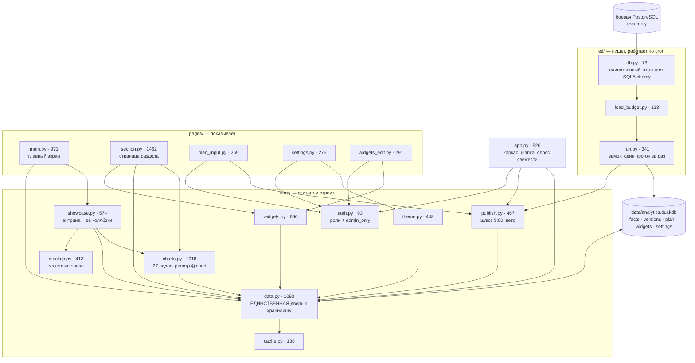

# Дорожная карта: сайт визуализации данных

## О проекте

Внутренний аналитический дашборд на Dash/Plotly с двумя источниками данных: факты — автоматически из боевой БД компании, план — вручную через форму в самом сайте.

- **Доступ:** только внутренняя сеть компании; сотрудники вне офиса — через корпоративный VPN. В открытый интернет сайт не публикуется.
- **Пользователи:** ≈70 человек — просмотр и фильтры; 2 админа визуала — дополнительно доступ к вводу плана и настройкам темы.
- **Обновление данных:** инкрементальный ETL каждые 5 минут (пересчёт только при изменениях в источнике) + автообновление открытой страницы через `dcc.Interval`.
- **Хранение:** собственный сервер компании.

## Статус на 03.08.2026

**Перенесён второй макет** (пакет `Даму дашборд_ варианты дизайна.zip`,
Claude Design). В нём четыре листа: «Главная», «Разделы», «варианты дизайна»
и снимок прежнего вида для сравнения. Что сделано:

| Лист | Куда лёг |
|---|---|
| «варианты дизайна» — раскладки 1a–1d | страницы-примеры `/explore/1…4` плюс список на `/explore` и меню «Разбор ▾» в шапке |
| — (не из макета) | `/explore/5` — доработка примера 3 по замечаниям, 04.08.2026 |
| «Главная», вариант 1b | `pages/main.py`: полоса-итог, три карточки, программы, карта |
| «Разделы», вариант 1b | `pages/section.py`: полоса с аббревиатурами, карточки по макету, заглушки со штриховкой, карточка ОКЭД |
| тёмная тема обоих листов | переключатель солнце/луна, палитра в `custom.css` |

Появились: **третий цвет темы** (`accent_3`, бирюзовый — инструментов три,
и на два цвета они не делились) и **тёмная тема** как личный выбор
в браузере. Числа поехали в русском формате: раньше карточки показывали
«1 307.9» с точкой рядом с «78,5» с запятой на витрине.

**Страницы-примеры временные.** Пользователь выбирает раскладку «Разбора»;
после выбора лишние удаляются, выбранная переезжает в обычную страницу,
а `pages/explore_example.py` и `core/examples.py` исчезают целиком.

## Карта файла

Файл большой, целиком читать его не нужно — ниже, где что лежит.
Номера строк приблизительные (файл правится); точные всегда даёт
`grep -n "^## " ROADMAP.md`.

- **План на 25.08.2026 — с чего продолжаем** — 97
- **Статус на 19.08.2026, вечер — правки по внешнему аудиту** — 175
- **Статус на 19.08.2026 — примеры и старая главная удалены** — 175
- **Статус на 18.08.2026, вечер — главная переехала в пример 5** — 150
- **Статус на 18.08.2026 — карточка регионов, поле у «Годов», тестовые месяцы СЭЭ** — 150
- **Статус на 17.08.2026 — редизайн страницы раздела по макету** — 93
  - Что решил пользователь — 100
  - Что сделано — 119
  - Три вещи из макета, сделанные иначе — 136
- **Статус на 13.08.2026 — «Суб. выдача» на данных, разбор дизайна, сверка чисел** — 150
  - «Суб. выдача» получила настоящие данные — 152
  - Правки СЭЭ: числа в столбцах, алфавитный порядок отраслей — 201
  - Отрицательные значения молча пропадали с графика — 223
  - Макетные числа не сходились сами с собой — 240
  - Разбор дизайна: что сделано и что откатили — 260
- **Статус на 12.08.2026 — Gemini испортил перформанс, левое выравнивание СЭЭ** — 293
- **Статус на 11.08.2026, вечер — Sentry, шапка, карточка, читаемость диаграмм** — 349
- **Статус на 11.08.2026 — заголовки, кэш, первые тесты, оценка проекта** — 369
  - Что показала независимая оценка — 397
  - Кэш: два ограничителя вместо одного несработавшего — 413
  - Тесты: 67 штук, полторы секунды — 433
- **Статус на 10.08.2026, вечер — правки главной и пример 6** — 449
- **Статус на 10.08.2026 — приглушённый текст в тёмной теме, блок «Уникальных»** — 508
- **Статус на 08.08.2026 — подсекции и свёрнутая динамика по годам (СЭЭ)** — 560
- **Статус на 07.08.2026 — вечер: подписи категорий пропадали при тесноте** — 607
- **Статус на 07.08.2026 — разобраны остальные колонки выгрузок** — 631
  - Побочный эффект: таблица распухла, и это пришлось чинить — 660
- **Статус на 07.08.2026 — вечер: подключены настоящие данные** — 690
- **Статус на 07.08.2026** — 730
- **Статус на 04.08.2026** — 791
- **Статус на 29.07.2026** — 906
- **Как читать этот файл** — 1020
- **Архитектура** — 1026
- **Стек по этапам** — 1113
- **Этап 0. Каркас (1–2 дня)** — 1128
- **Этап 1. Фронтенд на реальных данных (1,5–2 недели)** — 1141
  - Отложено — нужны другие данные — 1170
- **Этап 2. Реальные данные и ETL (1,5–2 недели)** — 1193
- **Этап 3. Соединение и «живость» (около недели)** — 1214
- **Этап 4. Ручной ввод и кастомизация (1,5–2 недели)** — 1225
  - Как устроена отложенная публикация — 1263
  - Главный экран из нескольких виджетов — сделано 27.07.2026 — 1359
- **Этап 5. Сервер и доступ (1,5–2 недели, частично с админами)** — 1395
  - Подготовка к этапу 5 — что сделано без сервера (24.07.2026) — 1461
- **Заметки на будущее** — 1498
  - @@ Справочник показа для виджетов — решено 07.08.2026, делать после дизайна — 1503
  - @@ «Разбор» станет витриной показателей на одной странице — 1575
  - Bootstrap переехал из интернета к нам — сделано 27.07.2026 — 1616
  - ✅ Главный экран из виджетов и кастомизация — сделано, заметка закрыта — 1640
  - @@ Осиротевшие настройки виджетов — вернуться, когда разделов станет много — 1663
  - Мобильные устройства — 1678
  - Три языка интерфейса (каз / рус / англ) — 1694
  - Замеренная производительность — 1718
- **Где сейчас проект** — 1750
  - Что ждёт решения человека, а не кода — 1827
- **Настоящие данные из файлов (07.08.2026)** — 2091
- **Куда стремимся (обсуждено 24.07.2026)** — 2163
- **Дизайн: откуда он взялся** — 2211

---

# План на 25.08.2026 — с чего продолжаем

Составлен 20.08.2026 по просьбе пользователя: «начнём всё это делать
25 августа». Порядок не случайный — сверху то, где причина уже найдена
и замерена, снизу то, что упирается в чужое решение или в сервер.

## 1. Производительность — начинать отсюда

Причина найдена и замерена (разбор — «Производительность: замерено,
но НЕ починено» ниже). Кода не трогали, направление известно.

1. **Свести чтения опроса свежести в ОДНО открытие DuckDB.** Сейчас
   их 5–6, каждое стоит 24–34 мс, потому что при закрытии последнего
   соединения база выгружается целиком. Ожидаемо 81 мс → ~25 мс.
   Трогать: `publish.publish_due`, `data.get_display_version`,
   `get_last_update_parts`, коллбэк `poll_version` в `app.py`.
2. **То же для страницы раздела** — там 11 открытий на отрисовку (227 мс).
3. `!!` **Соединения НЕ держать открытыми.** Проверено: удержанное
   читающее соединение полностью блокирует запись ETL из другого процесса
   (`IOException`). При 70 браузерах данные перестали бы обновляться молча.
   Правильное направление — открывать реже, а не держать дольше.

## 2. Четыре хвоста от уборки примеров

Каждый меняет вид экрана, поэтому и делались отдельно от удаления.

4. **Мёртвый CSS** — блоки «Пример 1/3/4» в `custom.css`. Чистить
   с проверкой глазами: часть классов общая с тем, что живо.
5. **Цвета инструментов** из `core/examples.py` → `core/theme.py`.
   Довод «примеры показывают предложенную гамму» отпал вместе с примерами.
6. **Переименовать `core/examples.py`** — имя больше ни на что не указывает.
   Делать вместе с п. 5, оба трогают тот же файл.
7. **Инлайновые стили главной** → `custom.css`. Были уместны, пока
   вариантов было шесть.

## 3. Читаемость

8. ✅ **Контраст исправлен 02.09.2026.** Тон «все инструменты» в тёмной
   теме: 3,45 → **4,69 : 1**. Приглушённый текст на светлой поверхности:
   3,56 → **4,78 : 1**; подписи герой- и KPI-карточек подняты до 11,2 px.

✅ **Глобальные фильтры возвращены 02.09.2026.** Год и регионы действуют на
все разделы, сохраняются между переходами, показывают текущий контекст и имеют
явный сброс. Подстановка последнего доступного года теперь помечается и у СЭЭ.
По замечанию пользователя полоса уплотнена до одной строки без видимых
заголовка, подписей полей и нижнего пояснения; доступные подписи сохранены
для экранных дикторов. `??` Визуальная проверка ждёт отдельного разрешения.

✅ **Дата в шапке уточнена 02.09.2026.** «Данные опубликованы» означает время
публикации версии, которую видит пользователь; это не время запуска ETL и не
дата изменения источника. Пульсирующий индикатор заменён статичной точкой.

✅ **Справочник регионов нормализован 02.09.2026.** 48 вариантов из разных
источников сведены к 20 регионам; `Абай`, `Жетісу`, `Ұлытау` показываются в
казахском написании. Служебные `Неизвестно` и `Департамент гарантирования`
остаются в фактах ради корректных итогов, но не выдаются географическим фильтром.

## 4. Из аудита — что можно без сервера

9. **Не возвращать клиенту сырые исключения** (п. 9 отчёта): `str(e)`
   уходит в ответы `plan_input.py`, `widgets_edit.py`, `settings.py`
   и может раскрыть пути и структуру таблиц.
10. **Lock-файл зависимостей** (п. 16): в `requirements.txt` 16 прямых
    пакетов, в окружении 74.
11. **Ротация логов** (п. 29): `data/etl.log` и `cron.log` растут без границ.

## 5. Ждёт РЕШЕНИЯ пользователя, а не работы

Это не задачи, это развилки — без ответа их делать нельзя:

- **СЭЭ против «СЭЭ 2»** — какой дизайн разрезов оставляем; выберете,
  и лишний раздел с ключом `render: plotly` удаляются;
- **герой-карточка на остальных разделах** — включается ключом `hero`;
- **источник помесячных данных СЭЭ** — сейчас выдуманные месяцы
  с подписью «тестовые»; вопрос источнику всё ещё открыт;
- **вторая полоса «проектов»** — оставлять ли;
- **состав раздела «Мониторинг»** — пять подсекций без содержимого.

## 6. Этап 5 — когда будет сервер

Вход по LDAP, сессии и CSRF, заголовки безопасности, systemd, nginx,
бэкапы с проверкой восстановления, CI, health-check, наблюдение за сайтом.
Всё это аудит перечислил верно, и всё упирается в доступ к серверу.

---

## Статус на 19.08.2026, вечер — правки по внешнему аудиту

Пришёл внешний отчёт (`AUDIT_RECOMMENDATIONS.txt`, 46 пунктов). Разобрали
его вместе с пользователем и взяли в работу четыре пункта — те, что
**не зависят от появления сервера**. Остальное либо и есть этап 5
(вход, сессии, заголовки, systemd, бэкапы, CI), либо преждевременно.

Заодно аудит поправил нас в мелочи, которую агент повторял много раз:
**тестов было 129, а не 79** — пересчитано командой сбора.

### Роль проверяется внутри изменяющих коллбэков, а не только в layout()

Главная находка отчёта, и она подтвердилась чтением кода: `pages/plan_input.py`
и `pages/widgets_edit.py` звали `auth.is_admin()` только в `layout()`.
Спрятать страницу мало — **коллбэк Dash это обычный POST
на `/_dash-update-component`**, и позвать его можно мимо разметки. То есть
отмена черновика, вето и правка состава виджетов были доступны любому,
кто знает адрес. Сотрудников семьдесят.

Сделан сторож `auth.admin_only` — декоратор, который вешается ПОД `@callback`
(порядок обязателен: Dash должен зарегистрировать сторожа, а не голую
функцию). Отказ — `PreventUpdate`.

`!!` Именно `PreventUpdate`, а не «вернуть `no_update` по числу выходов».
Выходов у коллбэков от одного до четырёх, и сторожу пришлось бы держать
рядом с `@callback` второе такое же число — пару чисел, обязанных
совпадать. Проект на этом уже обжигался (margin и сдвиг подписей СЭЭ
разъехались на пиксели). `PreventUpdate` от числа выходов не зависит вовсе.

Отказ пишется в журнал: молчаливый отказ на экране неотличим от поломки.

`pages/settings.py` не трогали — там проверка внутри коллбэка была
изначально, и аудит верно назвал её образцом; она к тому же показывает
человеку плашку, чего `PreventUpdate` не умеет.

### Значение из адреса больше не попадает в текст SQL

Пять мест в `core/widgets.py` склеивали номер страницы f-строкой прямо
в `WHERE page = '...'`, а приходит он из адреса. Чтение открыто
`read_only=True`, так что испортить базу было нельзя, — но подменить
условие можно: `x' OR '1'='1` превращал вопрос «набор ЭТОЙ страницы
настроен?» в «настроен хоть какой-нибудь?».

`core/data._query_storage()` научился принимать параметры, и все пять мест
переведены на `?`. Заодно параметризован фильтр версии в `_facts_cached`.
Остальные f-строки в проекте (`core/db.py`, `etl/*`) подставляют **имена
таблиц** из конфигурации, а не значения из браузера: параметрами имена
не передаются в принципе, и трогать их этой правкой было незачем.

### Один прогон ETL за раз

Cron запускает `etl.run` каждые пять минут и не спрашивает, кончился ли
прошлый. Пока прогон укладывается в секунды — безобидно; вырастет
источник — два прогона пойдут внахлёст, оба потянут факты из боевой БД
и подерутся за файл хранилища.

`!!` Замок сделан **в коде** (`etl.run.single_run`), а не флагом `flock`
в crontab, и это осознанно: флаг надо не забыть дописать, он защитил бы
только запуск из cron, но не запуск руками, и он же команда Linux —
а разработка идёт под Windows. Второй прогон уходит БЕЗ ошибки, но
со строкой в журнале: наложение не поломка, падать из-за него значит
слать письма об ошибке пять раз в час. Брошенный замок (процесс убили)
снимается по возрасту — иначе одно падение остановило бы ETL навсегда,
а заметили бы это по остывшим цифрам через сутки.

### 9:00 считается по названному поясу, а не по настройке сервера

Публикация брала голый `datetime.now()`. Риск был записан прямо
в `deploy/crontab-damu.txt`: сервер в UTC — и публикация молча уезжает
на 14:00 по Астане. Молча: ошибки нет, данные выходят, просто не тогда.

Появились `publish.BUSINESS_TZ` (`Asia/Almaty`) и `publish.business_now()`.

`!!` Пояс назван ИМЕНЕМ, а не сдвигом «+5 часов»: Казахстан менял смещение
в 2024 году, и вписанное число однажды протухло бы так же тихо. Имя следует
за базой часовых поясов, а её даёт пакет `tzdata` — он стоял в окружении
случайно, как чужая зависимость, и теперь записан в `requirements.txt`
явно. У Linux своя база обычно есть, у Windows нет вовсе.

`@@` Полный переход на UTC в хранилище (рекомендация аудита) НЕ сделан:
штампы в `plan` и `versions` наивные с самого начала, и переход означает
миграцию записанных строк. `business_now()` тоже возвращает наивную дату —
это компромисс, записан в её докстринге.

### Тесты

Заведён `tests/test_authz.py` — десять проверок на то, что защищает сервер,
а не интерфейс: зритель не входит в три изменяющих коллбэка, подстановка
в `page` не меняет условие запроса, кавычка в имени страницы не роняет
запрос, второй прогон ETL отбивается, брошенный замок перехватывается,
свежий чужой — нет, деловое время берётся из имени пояса.

Всего тестов стало **139**.

### `@@` Производительность: замерено, но НЕ починено — продолжить отсюда

Замер 19.08.2026. Аудит писал про «несколько отдельных открытий DuckDB»
и предлагал планировщик и переезд в PostgreSQL. Замер показал причину
проще и точнее — **и она не в запросах**.

| Что | Время | Открытий файла |
|---|---|---|
| Опрос свежести, зритель | 81 мс | 5 |
| Опрос свежести, админ | 119 мс | 8 |
| Главная (в контексте запроса) | 57 мс | 2 |
| Раздел СЭЭ (в контексте запроса) | 227 мс | 11 |
| `load_facts()` | 48 мс | 2 |

Стоимость целиком в одном: **DuckDB при закрытии ПОСЛЕДНЕГО соединения
выгружает базу, и следующее открытие грузит её заново.** Замерено:

- открыть+закрыть, когда других соединений нет — **24–34 мс**;
- то же, когда хоть одно соединение уже открыто — **0,38 мс** (в 60–90 раз
  дешевле);
- сам запрос на открытом соединении — 0,7 мс.

Отсюда сходится вся таблица: 11 открытий × 25 мс ≈ 227 мс у раздела.
То есть опрос свежести стоит дороже, чем отрисовка главной, ради которой
он и ведётся, — и идёт раз в 30 секунд с каждого браузера (70 браузеров =
2,3 вызова в секунду).

`!!` **Очевидное лечение — держать соединение открытым — ЛОВУШКА,
и это тоже замерено.** Пока процесс сайта держит читающее соединение:

- открыть запись В ТОМ ЖЕ процессе нельзя (`ConnectionException`) — это
  в проекте уже описано;
- открыть запись ИЗ ДРУГОГО процесса нельзя тоже (`IOException`,
  файл не открывается вовсе).

Второе и есть приговор: при 70 опрашивающих браузерах файл был бы
залочен на чтение почти всегда, и **ETL с публикацией 9:00 перестали бы
писать** — молча, без ошибки на экране, «данные просто перестали
обновляться».

Значит правильное направление — **не держать соединения дольше,
а открывать их реже**: собрать 5–6 маленьких чтений опроса в ОДНО
открытие (это и есть п. 21 аудита, но с измеренной причиной). Ожидаемо
81 мс → ~25 мс у опроса; у раздела 11 открытий → меньше, насколько
получится без удержания.

Не сделано: правка лезет в горячий путь (`publish.publish_due`,
`data.get_display_version`, `get_last_update_parts`, коллбэк опроса
в `app.py`), и делать её впопыхах не стоит.

`??` Ещё не проверено: п. 24 аудита про `SELECT *` в `etl/load_budget.py`.
Код посмотрел — там `SELECT *` действительно есть, но он собирает
`UNION ALL` по месячным таблицам как подзапрос `all_months`, из которого
дальше выбираются только нужные колонки. Тянет ли PostgreSQL при этом
лишнее — покажет `EXPLAIN (ANALYZE, BUFFERS)` на боевой базе, а не чтение
кода.

### Что из отчёта сознательно не делали

- **Вход, сессии, CSRF, заголовки, systemd, nginx, бэкапы, CI, health** —
  это и есть этап 5, он ждёт сервера. Не находки, а уже записанный план.
- **Публикация из опроса браузеров (п. 20).** Аудит предлагает отдельный
  планировщик, но планировщика нет НАМЕРЕННО (см. шапку `core/publish.py`).
  Это выбор, а не недосмотр; арифметику про 70 браузеров стоит проверить
  замером, а менять — вместе с появлением сервера.
- **Запрет demo/test в production (п. 4).** Премиса неверна: макетные числа
  и тестовые месяцы не спрятаны, они подписаны на экране плашками.
- **Вынести состояние в PostgreSQL (п. 5).** Переезд большой, а DuckDB
  отвергает конкурентную запись отказом, а не порчей (проверено на девяти
  процессах) — риск в доступности, а не в потере данных.
- **Дробление модулей (пп. 31–32), DOUBLE вместо DECIMAL (п. 18),
  инкрементальный ETL (п. 23)** — по последнему аудит и сам пишет «только
  при подтверждённом росте».
- **Сократить документацию (п. 40)** — отчёт сам себе противоречит:
  в сильных сторонах хвалит зафиксированные причины решений. Взяли только
  конкретную часть: раздел «Архитектура» правда перечислял удалённые
  `explore`-страницы — дерево файлов приведено в порядок.

## Статус на 19.08.2026 — примеры и старая главная удалены

Уборка после выбора раскладки. Пользователь дал добро отдельным
сообщением, как и предупреждал; перед удалением сделан коммит `6a424f1`,
чтобы уборка откатывалась одной командой и не смешивалась с работой,
которая ей предшествовала.

### Что удалено

| Что | Где было |
|---|---|
| Отдельная страница главной | `pages/main.py` (тонкая обёртка после переезда 18.08) |
| Страница со списком примеров | `pages/explore.py`, адрес `/explore` |
| Примеры 1, 3, 4, 6 и их кирпичики | `pages/explore_example.py` |
| Меню «Разбор ▾» в шапке | `app.py`, `navbar()` |
| Реестр примеров `EXAMPLES` и `by_key()` | `core/examples.py` |

### Что осталось и где теперь лежит

Бывший «пример 5» стал главным экраном: файл переименован
`pages/explore_example.py` → `pages/main.py` (через `git mv`, чтобы
история осталась прослеживаемой) и зарегистрирован на «/». Из 2103 строк
осталось 913 — ушли `_example_1/3/4/6`, `_ex4_*`, `_ex6_band/card/full`,
`_spark_months`, `_map_block`, `_title_row`, `_card_head`, `_month_bars`
и прочее, что держали только удалённые примеры.

Резал не руками, а скриптом по границам функций (`ast`): руками на файле
в две тысячи строк легко сдвинуть чужой блок. Скрипт удаляет `def`
целиком вместе с комментарием-шапкой над ним. Он же показал предел
такого подхода — после первого прохода приложение упало на
`NameError: _ex4_v1`: скрипт знал про функции, а константа
`EX4_VARIANTS` осталась ссылаться на удалённое. Вторым проходом убраны
и осевшие константы (`GRID_1`, `GRID_3`, `EX4_VARIANTS`). Вывод простой:
**после автоматического удаления обязателен запуск, а не только тесты** —
тесты разметку не трогают и этого бы не поймали.

`core/examples.py` не удалён: на нём висят `spark()` (герой-карточка
раздела) и цвета инструментов с `num()` (главная). Из него убран только
реестр примеров.

### Кнопка переехала в строку разбивки, легенда убрана

Просьба пользователя: убрать из строки «Разбивка по программам» легенду
(«Освоено, млрд ₸» / «Проектов, шт») и поставить на её место кнопку
разворота, переименовав в «Развернуть».

Легенда ушла без потери: у каждой строки разбивки число подписано прямо
у полосы и с единицей («126 млрд», «19 шт»), так что легенда объясняла
то, что и так написано рядом.

`!!` **А вот кнопок пришлось сделать ДВЕ, и это не самодеятельность.**
Строка «Разбивка по программам» лежит ВНУТРИ свёрнутого состояния,
а оно при развороте гасится — `opacity: 0` и `pointer-events: none`
в `custom.css`. Одна кнопка, переехавшая туда, после разворота стала бы
невидимой и ненажимаемой: свернуть обратно было бы нечем. Поймано ДО
правки, чтением CSS; пользователю показано и выбор («две кнопки» против
«оставить своей строкой») сделан им. Теперь «Развернуть» стоит в шапке
разбивки, «Свернуть» — своей кнопкой в развёрнутой витрине.

Следствие в JS: **подписи кнопок больше не переписываются**. Пока кнопка
была одна, `dashboard.js` менял ей текст после каждого нажатия. С двумя
кнопками это стало бы ошибкой — «Развернуть» превращалась бы в «Свернуть»
ровно в тот миг, когда её саму скрывают, и обратно уже не вернулась бы.

`??` Глазами не проверено — пользователь смотрит сам. Проверено сборкой
страницы и тестами; ход «туда-обратно» двумя кнопками в браузере
не прогонялся.

### Карточка итогов не была покрашена — и это был не недосмотр дизайна

Пользователь: «проработай цвет … именно все инструменты». Оказалось, цвет
там не «не подобран», а **вообще не доезжал**. Тон в этой раскладке
приходит переменной `--ex5-k`, а ставит её класс `damu-ex5-c1…c4`
(`custom.css`, «Пример 5 — цвета инструментов»). Соседние карточки берут
класс в `_ex5_programs` из `EX5_PROG_CLASS`, а карточка итогов собирается
отдельной функцией — и осталась без него.

Последствие хуже, чем «серый заголовок»: `var(--ex5-k)` не разрешается,
и **заливка полос становится прозрачной**. На снимке пользователя дорожки
«Бюджета» и «Проектов» стоят пустыми, хотя рядом написано «74,3 %»
и «74,9 %» — то есть карточка показывала процент и НЕ показывала его же
полосой. Ошибки при этом ни одной. Ровно тот случай, про который в CLAUDE.md
написано «цвет, пришедший не через наши переменные, обходит тему МОЛЧА», —
только здесь молча обошло вообще всё.

Заодно карточка переоформлена: у каждого блока появился кикер («Бюджет,
млрд ₸», «Проекты, шт», «Состав проектов»), единица переехала в кикер
из хвоста числа, процент встал справа в одну строку с числами — так
у обоих блоков правый край держит одна вертикаль.

### «Всё какое-то кривое» — три расхождения, все замерены

Формулировка была общая, поэтому по снимку не гадал, а замерил в браузере.
Нашлось три:

| Что | Было | Стало |
|---|---|---|
| Низы колонок | левая 549 px, правая 599 | обе 602,6, разница 0 |
| Верх содержимого | первая карточка разбивки на 4 px выше первой строки слева | 0,5 px |
| Карточка итогов против «Кредитования» | 8 строк против трёх блоков, низ не сходился | обе 308,1 px |

**Низы колонок.** Левая карточка стояла `align-self: start` — она не
тянулась. `!!` Тянуть её уже пробовали 13.08.2026 и откатили: карточка
растягивалась, а строки внутри оставались своей высоты, и разница копилась
пустой полосой в 137 px. Сейчас сделано иначе: тянется карточка, а лишнюю
высоту разбирают САМИ строки (`flex: 1` у каждой). Замерено — строки
выросли со 127 до 140,5 px каждая, пустой полосе взяться неоткуда.
Прежний откат отменяет не забывчивость, а другое устройство.

**Верх содержимого.** Шапка левой карточки занимает 40 px, полоса
заголовка справа занимала 36,5 — из-за этих 4 px столбцы ехали друг
относительно друга. Полосе задана `min-height: 32px`.

✅ **Исправлено 02.09.2026.** Тон `c1` заменён целиком, а не только в
карточке: `#3b9567` на поверхности `#1c1a19` даёт **4,69 : 1** вместо
3,45 : 1. Тем же заходом `--damu-muted` светлой темы поднят до 0,65:
на поверхности `#eae9e9` получилось **4,78 : 1** вместо 3,56 : 1.
Подписи герой- и KPI-карточек увеличены до 0,7 rem (≈11,2 px).

### Что осталось незакрытым

- `@@` **Мёртвый CSS.** Блоки «Пример 1/3/4» в `custom.css` остались.
  Чистить вслепую опасно: часть классов общая с тем, что живо, а проверить
  каждый можно только глазами. Отдельной задачей.
- `@@` **Цвета инструментов всё ещё в `core/examples.py`.** Довод, по
  которому они там лежали («примеры показывают предложенную гамму,
  а не тему сайта»), отпал вместе с примерами — пора в `core/theme.py`.
- `@@` **Имя `core/examples.py` теперь врёт** — «examples» больше ни
  на что не указывает.
- `@@` **Инлайновые стили на главной.** Были уместны, пока вариантов
  было шесть: инлайн держал каждый в одном месте, и удаление функции
  не оставляло следов в общем CSS. Вариант теперь один, довод отпал.

Все четыре — отдельными задачами намеренно: каждая меняет вид экрана,
и делать их заодно с удалением значило бы смешать в одном коммите
уборку и правку внешнего вида.

## Статус на 18.08.2026, вечер — главная переехала в пример 5

**Дизайн примера 5 одобрен.** Отсюда всё остальное: он становится будущим
боевым экраном, главная переезжает в него вторым состоянием, а лишние
примеры и отдельная страница главной удаляются — но только после переезда
и по отдельному «добро» пользователя (сказано прямо, 18.08.2026).

### Главная переехала в `core/showcase.py`

Раскладка витрины (полоса-итог, карточки инструментов, разбивка по
программам, заголовок с кнопками года, карта) и **три её коллбэка** ушли
из `pages/main.py` в новый `core/showcase.py`. `pages/main.py` остался
тонким: адрес «/», проверка хранилища, вызов `showcase.body()` — 56 строк
вместо 567.

Почему не проще — импортом из `pages/main.py`. Так было бы меньше работы,
и я проверил, что это **технически возможно**: в `core/examples.py`
записано, будто страница, импортирующая другую страницу, задваивает её
коллбэки, — запуск это опроверг (Dash грузит страницы под именами
`pages.main`, `pages.explore_example`, а кэш модулей Python не даёт
выполнить файл дважды; коллбэков после двойного импорта ровно 3, не 6).
Но переезд задуман с концом: главную потом удаляют. Импорт из удаляемого
файла — это отложенная поломка, а не решение.

`!!` **Коллбэки лежат в `core/`, и это единственное такое место.** Уклад
проекта другой — `core/` считает и строит, слушают страницы. Нарушен
намеренно: витрину показывают ДВЕ страницы, а Dash не даёт зарегистрировать
два коллбэка на один выход, значит слушать может кто-то один. Оставь мы
его в странице — удаление именно этой страницы молча отняло бы у витрины
кнопки года, тумблер «Графики за весь год» и карту: разметка на месте,
ошибки нет, просто ничего не нажимается. Теперь витрина переживает
удаление любой из двух страниц.

`!!` Идентификаторы (`main-view`, `main-showcase`, `main-map`) общие для
обеих страниц. Не оплошность: Dash показывает одну страницу за раз, в дереве
они дважды не встречаются, а коллбэк находит те поля, что сейчас на экране.

### Разворот встроен в САМ пример 5, а не в отдельную страницу

`!!` **Тут я сделал не то и переделывал.** Сначала завёл под это отдельный
пример 7 — потому что на вопрос «куда положить» предложил пользователю
всего два варианта: «переделать пример 6» и «новый пример 7». Нужного
варианта — «прямо в пример 5» — в списке не было, хотя пользователь
трижды написал именно «в пример 5». Он выбрал ближайшее из предложенного,
и вышло мимо. Урок не про Dash: **если ни один из вариантов не повторяет
того, что человек уже сказал словами, список составлен неверно.**

Как стало: `/explore/5` — свёрнутое состояние (сам пример 5), по кнопке
разворачивается **настоящая главная** (`core/showcase.body()`, та же
функция, что рисует «/»), в своих цветах и со всеми живыми органами.
Проверено в браузере: клик по «2025» внутри развёрнутого состояния
пересчитал итог с 74,3 на 95,1 %, карта настоящая (1151 px, 21 след).

Пример 6 приведён к тому же виду (просьба пользователя): свёрнутое
состояние у них теперь **общее** — одна функция `_expandable`, не копия.
Раньше шестой показывал `_ex5_body()` без встроенного заголовка плюс свою
строку `_title_row` сверху, из-за чего два примера отличались ещё
до нажатия кнопки — а сравнивают в них ровно то, что после нажатия.
Замерено после правки: свёрнутая высота у обоих 597 px, кнопка на тех же
55 px от правого края, «Освоение плана» на экране ровно одно.

Отличаются примеры теперь единственным — тем, что раскрывает кнопка:
у пятого настоящая главная, у шестого её копия в цветах примера 5
(`_ex6_full`). Копия оставлена ради этого сравнения: видно, нужна ли
смена цвета на полпути.

Кнопка «Развернуть как на главной» — справа сверху у обоих (просьба
пользователя). Отдельной строки заголовка над ней нет: заголовок есть
у каждого состояния свой, третий на том же экране был бы лишним.

Обработчик разворота в `dashboard.js` переведён с id на **класс**
(`.damu-ex6-toggle`, `.damu-ex6`): обёрток теперь две с разными id
(`damu-ex5` / `damu-ex6`), и завязанный на одно имя обработчик работал бы
ровно на одной.

`??` **Саму анимацию разворота глазами не проверил.** Панель браузера
не компонует кадры, поэтому CSS-переход в ней не двигается и застревает
на начальном значении — замер показывал «свёрнуто» при уже выставленном
`data-mode="full"`. С отключённым переходом слоты меняются правильно
(в примере 5: свёрнутое → 0, развёрнутое → 1793 px; в примере 6 → 1361 px),
то есть раскладка и логика верны, а плавность перехода остаётся
непроверенной. То же ограничение уже записано про подсветку «пилюль».

### Правки самого примера 5

**Четвёртая карточка в разбивке — итоги «Все инструменты».** Заняла клетку,
которая в сетке 2×2 пустовала: программных колонок три, а клеток четыре.
Показывает то, чего в разбивке нет вовсе, — план против факта: бюджет
(1 421 из 1 912 млрд ₸, 74,3 %), проекты (1 049 из 1 400 шт, 74,9 %)
и состав проектов одной полосой (уникальных 775, повторных 274).

`!!` Это НЕ возвращение колонки «Все инструменты», убранной 13.08.2026.
Ту убрали за дело — она повторяла программными строками те же числа, что
стоят карточками слева. Здесь другое содержание, и повтора не возникает:
в разбивке по программам плана нет, только факт.

Ставится только в примере 5 (`with_totals`): там сетка два в ряд. В примере 6
колонки идут по три, и четвёртая карточка начала бы вторую строку
в одиночестве — на месте одной дыры появилась бы другая, шире прежней.

**Полоса и процент крупнее** — 14 → 18 px высоты, 14 → 17 px у процента,
колонка процента 58 → 66 px (иначе «100,0 %» переносилось бы). Заодно
названия 15 → 16, сумма 17 → 19, хвост «из X млрд ₸» 13 → 14. Это главная
строка примера, а весила она столько же, сколько подписи вокруг.

**Полоса у проектов убрана,** осталось «Уникальных: N». Она повторяла
мысль левой полосы, но тоньше и без числа, а рядом с выросшей левой
читалась её бледной копией.

`??` «оставь только уникальных проектов» я прочитал как «из пары полоса +
строка уникальных оставить строку»: дробь «1 049 / 1 400» над ней осталась.
Если имелось в виду убрать и её — сказать, это одна строка.

## Статус на 18.08.2026 — карточка регионов, поле у «Годов», тестовые месяцы СЭЭ

Пять точечных правок по замечаниям пользователя на герой-карточке СЭЭ,
без редизайна.

**Список регионов в герой-карточке — 10 вместо 5.** `HERO_REGIONS`
(`pages/section.py`) увеличен с пяти до десяти — половина из двадцати
регионов страны. Раньше список кончался заметно выше низа карточки,
и `margin-top: auto` на заголовке блока (`.damu-sec-wrap--see
.damu-hero-reg-head`, `custom.css`) выбирал разницу пустым воздухом
НАД списком, а не под ним — то есть прошлая правка (17.08.2026) просто
переставила пустоту, а не убрала её. Замерено в браузере: с десятью
строками зазор сверху и снизу списка — обычные ~16 px отступа, не дыра.

**У диаграммы «Годы» было 120 px пустоты справа — общий баг, не только
у СЭЭ.** Правое поле в `charts.build()` считалось по ширине виджета
(`(columns or 12) * 10`) для ЛЮБОГО вида диаграммы — оно задумано под
числа у концов ГОРИЗОНТАЛЬНЫХ полос («Полосы — рейтинг» и похожие), но
применялось и к вертикальным столбцам вида «Годы», где справа не
подписано ничего. На широком пресете (12 колонок) это было 120 px
дохлого места, читавшихся как «столбцам не хватило места». Поле теперь
зависит от ориентации первой трассы фигуры (`fig.data[0].orientation`):
горизонтальным видам оставлены прежние 120 px, вертикальным — 16 px.
Правка одной строкой чинит все вертикальные виды разом, не только «Годы».

**«Разбивка по месяцам» у СЭЭ включена на выдуманных числах.** У СЭЭ
в источнике только декабрь (см. тест `test_see_uses_test_months_because
_source_is_december_only`), и раскрытие года при клике раньше показывало
отказ вместо диаграммы. Теперь у всех четырёх виджетов «Динамика по
годам» СЭЭ (`see:years_output/jobs/tax/saved` в `config.yaml`) стоит
флаг `test_months: true` — тот же приём, что уже был у СЭЭ 2: годовой
итог раскладывается на 12 месяцев прозрачной формулой (`data.
get_test_monthly`), и на экране это явно подписано «тестовые месяцы» /
«Тестовая разбивка». Это ответ на открытый вопрос «спросить источник»
из CLAUDE.md для целей демонстрации; сам вопрос («придут ли настоящие
месяцы») остаётся открытым — метка снимается заменой `get_test_monthly`
на `get_monthly` в одном месте, когда источник ответит.

**Закрытие разбивки повторным кликом уже работало.** Пользователь
попросил уметь выходить из разбивки не только кнопкой «✕ к годам»,
но и повторным кликом по диаграмме. Оказалось, это уже сделано —
`pick_drill_year` в `pages/section.py` сворачивает раскрытый год при
ЛЮБОМ клике по уже раскрытой диаграмме, каким бы месяцем ни попали.
Проверено в браузере эмуляцией `plotly_click`: клик по любому месяцу
возвращает к годовому виду. Кода править не пришлось — только числа
(без них проверить было нечем, диаграмма не раскрывалась).

**«Созданные раб. места» получили тот же график, что у остальных трёх
вкладок.** Карточка стояла на `hero: compare` (два числа столбиком,
2023/2024) вместо спарклайна — из-за того же восьмикратного обвала
2019→2020, который на полных годах сплющивал линию. Решение то же, что
уже подобрали для СЭЭ 2 (см. `config.yaml`, ключ `see2`): `hero: trend`
с обрезанным окном `hero_spark_years: 4` — спарклайн по 2021–2024, где
разброс честный. Проверено в браузере: линия из четырёх точек занимает
почти всю высоту (1.5–27.5 из 30 px), не сплющена.

Заодно дважды остановлены зависшие процессы `app.py` — сначала четыре
(просьба пользователя «останови все процессы», накопились от прежних
запусков без завершения), затем ещё четыре новых, появившихся за время
самой этой сессии тем же образом.

## Статус на 17.08.2026 — редизайн страницы раздела по макету

Источник — макет «Разделы — редизайн» из проекта UI-макетов пользователя.
Перед работой макет сверен с сайтом; два расхождения задевали решения,
записанные инвариантами, поэтому вынесены пользователю на выбор, а не
сделаны молча.

### Что решил пользователь

| Вопрос | Решение |
|---|---|
| Вкладка переключает содержимое или прокручивает ленту? | **Переключает**, как в макете — откат решения от 29.07.2026 |
| Разрезы рисовать Plotly или CSS-полосами, как в макете? | **Plotly**, реестр виджетов остаётся рабочим |
| На каких разделах делать? | **Сначала СЭЭ**, остальные потом |

Второй ответ важен отдельно: макет рисует все разрезы `div`-ами, и приняв
его буквально, мы бы вывели из работы весь механизм виджетов — 27 видов
диаграмм, реестр `section_widgets_by_page`, пресеты размеров и страницу
их настройки. Взяли из макета обрамление, содержимое оставили своим.

### Что сделано

- вкладка переключает содержимое; активную знает сервер (`section-tab`),
  подсветка отнята у браузера — иначе за один класс брались бы двое;
- внутри группы лента и пилюли остались как были, вместе с отложенной
  постройкой диаграмм;
- герой-карточка у четырёх подсекций СЭЭ: число выбранного года,
  спарклайн шести лет, дельта к прошлому году; вид задаётся ключом `hero`
  в `config.yaml` (`trend` / `compare`);
- плашка у заголовка раздела: «Реальные данные» или «Макетные числа»,
  считается по самим данным (`get_programs()`), а не по конфигу;
- подпись группы над рядом пилюль;
- пять тестов: четыре на выбор года и формат числа в карточке, один —
  на то, что разные тона дают разные цвета.

### Три вещи из макета, сделанные иначе

1. **Тон — по показателю, а не по порядку вкладки.** Раздача цвета
   по показателю решена с пользователем 11.08.2026; брать его от места
   значило бы отменить то решение ради вида. Картинка вышла та же:
   у четырёх подсекций СЭЭ тона 1, 2, 3, 2.
2. **Число и дельта не покрашены.** Замер в браузере: тон на поверхности
   карточки даёт 2,66 : 1 (золото, светлая тема) при 3 : 1 для крупного
   текста, а дельта в 11,5 px не набрала своих 4,5 : 1 ни в одной
   из восьми пар. Цвет остался на черте и спарклайне.
3. **Клик по году → помесячно.** В первом заходе не сделали с формулировкой
   «данных нет» — и ошиблись: проверили только СЭЭ, у которого в источнике
   правда один декабрь, и распространили вывод на весь сайт. Помесячные
   данные есть у четырёх разделов из пяти. Сделано во втором заходе.

### Второй заход (по замечаниям к первому)

- **раскрытие года в месяцы** — клик по столбцу, повторный клик или
  «✕ к годам» сворачивают. Там, где месяцев в источнике меньше двух
  (СЭЭ), диаграмма остаётся годовой, а надпись говорит почему: один
  декабрьский столбец под заголовком «по месяцам» был бы неверным
  утверждением о данных;
- **подсветка категории** — клик по отрасли гасит остальные полосы
  во всех четырёх диаграммах разреза сразу. Целиком в браузере;
- **единица измерения только в заголовке** — «Выпуск продукции (млрд ₸)»
  вместо «млрд ₸» на каждом из двадцати столбцов. Убраны также угловая
  надпись и заголовки осей;
- **топ-5 регионов в герой-карточке** — тем и заполнено пустое место
  под числом.

По пути найдено, что Plotly отдаёт числовые оси двоичным блоком, а не
массивом: обход такого объекта возвращает пусто без ошибки, и подсветка
молча не работала бы. И пойманы две собственные регрессии переноса
заголовка — обе тем, что замерили, а не посмотрели.

### Третий заход (по замечаниям ко второму)

- **карточка перестала растягиваться** — топ-5 регионов пустоту не закрыл:
  колонка тянулась на всю высоту графика, а прижим списка к низу вырезал
  дыру в 200 px посередине. Стало 342 px по содержимому против 484 px
  графика рядом;
- **«✕ к годам» больше не появляется там, где ничего не раскрылось** —
  кнопка возврата над диаграммой, которая никуда не уходила, говорила
  человеку, что он куда-то попал;
- **названия категорий стали кликабельными** — у СЭЭ подписи оси нарисованы
  надписями, и им включён `captureevents`. Нажатие на «A · Сельское,
  лесно…» зажигает отрасль во всех четырёх диаграммах разреза. У остальных
  разделов подписи — обычные деления оси, там кликается только полоса;
- **у вида «месяцы» вернулась единица в заголовок** — свой заголовок
  он собирает отдельно, и при общей правке про него забыли.

Проверено кликом в браузере: раскрытие года, возврат, отказ на СЭЭ,
подсветка по названию и по полосе, высота карточки, заголовки всех
виджетов пяти разделов.

`??` Снимок экрана получить не удалось — панель предпросмотра не отображается
и не компонует кадры. Из-за этого же не работает `requestAnimationFrame`,
а на нём висит подсветка «пилюль» при прокрутке: её глазами не проверяли.

### Четвёртый заход: зависание и переход разрезов на дивы

**Сайт завис у пользователя при клике по ОКЭД.** Причина — кольцо:
`plotly_afterplot` был повешен, чтобы подсветка не терялась при перестройке
диаграммы сервером, но `applyPin` внутри звал `Plotly.restyle`, а `restyle` —
это перерисовка, то есть снова `afterplot`. Вкладка уходила в цикл намертво.

`!!` **Замер этого не поймал, и вот чем это поучительно.** В панели
предпросмотра страница не компонует кадры, и `plotly_afterplot` там
не срабатывал вовсе — цикл просто не запускался. Проверка в неполноценной
среде показала рабочим то, что в настоящем браузере вешало вкладку.
Вывод не «замерять не надо», а «знать, чего именно среда не проверяет»:
о том, что в ней не работает `requestAnimationFrame`, было известно
за час до этого, и связать одно с другим было можно.

**Разрезы переведены на строки-дивы** (решение пользователя после разбора).
Замер, который его подготовил: на 20 разделах стоит 505 виджетов, в них
используется 11 видов из 27, и по форме это всего четыре вещи — крупное
число, лежачие полосы, стоячие столбцы и полукруглая шкала. Три из четырёх
проект и так умеет рисовать без Plotly. Перевели самое нужное — лежачие
полосы (113 виджетов), где и нужен клик.

Что от этого стало проще:

| | было на Plotly | стало на дивах |
|---|---|---|
| Клик по строке | только по полосе; по названию — лишь у СЭЭ и через `captureevents` | вся строка, во всех разделах |
| Подсветка | `restyle` четырёх фигур, два тормоза против кольца | класс CSS |
| Названия | обрезаны при постройке («C · Обрабатывающая…») | полные, обрезает показ CSS, полное имя в подсказке |
| Двоичные массивы, `_fullData` | приходилось обходить | не нужны |

Мёртвый код подсветки Plotly (208 строк) снят целиком: недостижимый код
с историей «вешал вкладку» — это заряженное ружьё на стене.

**Раздел «СЭЭ 2»** (просьба пользователя) — те же данные СЭЭ, те же
«Отрасли» и «Регионы», но прежним видом на Plotly. Стоит рядом в списке
разделов, чтобы выбрать дизайн глазами, а не по описанию. Работает
на двух новых необязательных ключах: `program:` у раздела (чьи данные
показывать) и `render: plotly` у виджета (каким видом рисовать разрез).
Оба удаляются вместе с разделом, когда выбор сделан.

Разбор каждого решения, таблицы замеров и найденная ошибка с двумя
одноимёнными функциями — CODE_GUIDE, «Редизайн раздела: вкладка
переключает, герой-карточка (17.08.2026)».

---

## Статус на 13.08.2026 — «Суб. выдача» на данных, разбор дизайна, сверка чисел

### «Суб. выдача» получила настоящие данные

Пользователь добавил пятый файл в «файлы для теста»: `Субсидирование.xlsx`
(121 тыс. строк, 2010–2026). Разобран тем же способом, что и первые
четыре (`etl/load_test_data.py` → `load_subsidies()` → `demo_facts`).

**Единственная колонка суммы — `PROJECT_AMOUNT`, это объём просубсидированного
кредита, а не сама субсидия.** В выгрузке нет колонки с суммой субсидии —
только объём проекта/кредита, получившего льготную ставку. Смысл тот же,
что у `credits_issued`/`guarantees_issued` (объём инструмента, не плата
за него), поэтому заведён отдельный показатель `subsidy_project_amount`,
а НЕ переиспользован боевой `subsidies_issued` (тот едет из бюджета БД
через `etl/load_budget.py` и означает другое число — реальную сумму
субсидии). Смешать их в одну сумму значило бы сложить разнородное.

Колонки программы дублированы, как раньше у «Гарантирования»:
`PROGRAM_NAME` — 28 сырых формулировок, `PROGRAM_NAME.1` — 7
сгруппированных (ЕКП, Іскер аймақ, МТИ, Нурлы Жер, ПРООН, ПС, ПСЭ). Взята
сгруппированная, тем же правилом («источник уже свёл разное написание
одного и того же»). «Іскер аймақ» — это те же вкладки-заглушки внутри
раздела `subsidy` (`iskeraimak_limits`, `iskeraimak_pipe`), отдельного
раздела сайта под неё заводить не нужно — `section_for()` и без того
кладёт все строки инструмента в «Суб. выдача».

`!!` **Скалярное присвоение первой колонке пустого `DataFrame` не
размножается на строки.** `out["indicator"] = "subsidy_project_amount"`,
записанное ДО того как у `out` появился настоящий индекс, дало столбец
из одних `NaN` — все 121 тыс. строк молча выпали при агрегации, без единой
ошибки (нашлось сверкой суммы `demo_facts` по показателям, не рассуждением).
Исправлено списком `["subsidy_project_amount"] * len(df)`, как в
`load_credits()`. Урок: скаляр в новый столбец пустого `DataFrame` пишется
последним, когда индекс уже задан другими колонками — не первым.

Заполнено по факту, что было в файле:
- вкладка «Годы» — реальный показатель вместо макетного `demo_fact`;
  KPI сокращён до одной карточки (плана и остатка тут взять неоткуда);
- вкладки «Программы/Цели займа» и «БВУ/Субъектность» переведены
  из `data: false` в `data: true` — разрезы приехали в том же файле;
- «ОКЭД/Регионы» уже был `data: true`, просто сменился показатель.

Бюджет, план, лимиты и пайп Іскер Аймақ по-прежнему `data: false` —
этого в транзакционной выгрузке нет и не должно быть, там не бюджетный
файл, а список выдач.

`??` **Не проверено глазами:** в самый плотный год (2025) по разделу
проходит 32 разных банка на диаграмме `size: large` — сопоставимо
с «Гар. выдачей» (28 банков на том же пресете), но не то же самое число.
Сам раздел на сайте позже открывался, до этой диаграммы не дошли.

### Правки СЭЭ: числа в столбцах, алфавитный порядок отраслей

Числа у вида «Годы» переехали ВНУТРЬ столбца (`textposition="inside"`),
по центру высоты (`insidetextanchor="middle"` — по умолчанию plotly жмёт
подпись к верхнему краю), 20 px полужирным вместо общих 16 px. Только
у СЭЭ: остальные разделы оставлены с прежними подписями снаружи, чтобы
было с чем сравнить.

`!!` **Цвет этой подписи пришлось выносить в своё правило.** Общий
`--damu-ink` не знает, что подпись переехала на заливку, а замер показал:
из шести пар «тема × акцент СЭЭ» норму 4,5 : 1 проходит ОДНА (золото
на светлой, 5,16). Зелёный на светлой — 3,12, золото на тёмной — 2,70.
Фиксированный цвет тут не спасает ни один. Решение — белый текст
с тёмной обводкой (`paint-order: stroke fill`): держит контраст на любой
из трёх заливок. Класс `damu-inside-text` вешает `pages/section.py`
на этот виджет и только на него, правило — в `custom.css`.

Заведён `industries_alpha` — тот же разрез по отраслям, но порядок
по коду секции ОКЭД (A, B, C…), а не по значению. Подключён к одному
из четырёх виджетов вкладки «Отрасли», остальные три для сравнения
остались по значению. Видов диаграмм стало 27.

### Отрицательные значения молча пропадали с графика

Пользователь заметил: у части отраслей в «Создано раб. мест» нет ни
столбца, ни числа. Оказалось — **у оси был жёстко задан старт с нуля**
(`range=[0, top]`), а у трёх отраслей значение отрицательное: столбец
рос бы влево от нуля, но диапазон его туда не пускал. Ни ошибки,
ни пустой строки — просто дыра в списке.

Сами минусы — настоящие данные, проверено в исходном Excel и подтверждено
пользователем у источника: **в этих отраслях позиции сокращались,
и часть из них исчезла совсем**, так что «создано» вышло в минус. Не сбой
разбора и не то, что надо прятать.

Границы оси теперь считаются от `min`/`max` разреза. Правка общая для
всех разрезов (банки, программы, отрасли), а не только для СЭЭ: любой
отрицательный столбец где угодно теперь виден.

### Макетные числа не сходились сами с собой

Пользователь сверил экраны: карточка «Все инструменты» показывала 1 501,
а разбивка по программам рядом — 1 421. Разошлись, потому что **и то,
и другое было вписано руками**, а не посчитано. Дальше оказалось хуже:
у «Кредитования» строки по проектам складывались в 19 714 штук при факте
470 — в сорок два раза.

Теперь в `core/mockup.py` итог СЧИТАЕТСЯ: «Все инструменты» — сумма трёх
инструментов (и по деньгам, и по проектам, и по всем четырём помесячным
рядам), а строки разбивки масштабируются под факт своей карточки
(`_scale_rows()`: форма — какая программа крупнее — сохраняется, точной
становится сумма). Сторожит `_check_programs()` при импорте — тем же
приёмом, что и живший рядом `_check_sums()`.

`!!` Наивное пропорциональное округление обнуляло мелкие программы:
разброс исходных весов у «Кредитования» доходил до 833 раз, и на экране
выходило «126 млрд ₸, 0 шт» — деньги есть, проектов будто нет. Поэтому
ненулевой строке гарантирована единица, остаток занимается у крупных.

### Разбор дизайна: что сделано и что откатили

По просьбе пользователя — независимая критика всего дизайна. Из неё
сделано:

- **Плашки статуса убраны целиком** (главная, примеры 1, 4, 6 и данные
  макета). Тревога красилась тёплым золотом — тем же цветом, каким
  обозначено «Кредитование»: один цвет нёс и «это инструмент такой»,
  и «это плохо». Заодно ушли `LATE`, `_status()`, `status_color`
  и тест на статус.
- **Цвет «Все инструменты» поднят** `#17452e` → `#106b40`. Прежний
  (18 % светлоты) читался как «почти чёрный»: у очень тёмных цветов
  оттенок глазом не различить, какой бы он ни был. Значение теперь
  одинаковое в `core/examples.py` и в `custom.css` — до этого они уже
  успели разъехаться.
- **Название карточки инструмента крупнее** — 14 → 18 px.
- **Год в примере 5 показан кварталами**, а не двенадцатью месяцами:
  три прошедших месяца сворачиваются в одну клетку с их суммой, хвост
  короче квартала остаётся месяцами, будущие кварталы не рисуются
  вовсе. Квартальная клетка вдвое шире месячной.
- **Колонка «Все инструменты» убрана из разбивки по программам**
  (пример 5; в примере 6 её не было и раньше) — её три строки дублируют
  карточки инструментов слева, на одном экране один разрез дважды.

`!!` **Что откатили.** Критика предлагала свести четыре независимые
реализации «разбивки по программам» в одну и заменить сетку «бабочкой»
(как на главной). Сведение сделали, вид поменяли — пользователь посмотрел
и сказал «ужасно». **Панель возвращена к прежнему виду целиком**, текстом
из коммита `6ffbd99`, а не по памяти. Четыре реализации при этом снова
живут порознь, и это осознанная цена: форму выбирает пользователь,
а не соображение об экономии кода. Возвращаться к объединению — только
вместе с одобренной формой.

## Статус на 12.08.2026 — Gemini испортил перформанс, левое выравнивание СЭЭ

Пользователь попросил другой ИИ-инструмент (Gemini через Antigravity)
переименовать один заголовок в разделе СЭЭ. Тот работал над проектом
25 минут и заодно вписал код, который сажал производительность всей
страницы — найдено сравнением коммита построчно с работой этой сессии,
не на слово. Разбор всех шагов — CODE_GUIDE, «Левое выравнивание подписей
СЭЭ: от опасного JS до сервера».

**Найденная поломка:** `MutationObserver` на весь `document.body` плюс
`getBBox()` в цикле по каждой подписи каждого графика на любое изменение
DOM где угодно на странице. `getBBox()` заставляет браузер синхронно
пересчитывать раскладку — на четырёх больших графиках СЭЭ это сотни
пересчётов за один проход. Отсюда «графики грузятся по 5 секунд».

**Починка — та же идея пользователя (подписи регионов растут от одного
левого края, как в оригинальном портале), но на сервере:**
`_left_align_categories()` в `core/charts.py` прячет подписи оси и рисует
свои `annotations` — ноль обращений к DOM. По пути нашлась и починена
ещё одна настоящая ошибка: `xref="paper"` в Plotly на категориальной оси
даёт x=0 не в левом краю картинки (как гласит интуиция и многие источники),
а в левом краю самой области построения — подписи заходили на полосы
до 172 px. Проверено `getScreenCTM()` в браузере, не предположением.
Починено переходом на `xref="x domain"`.

**Побочные находки, обе решены с пользователем, а не молча:**

- конфиг «Регионов»/«Отраслей» СЭЭ откатился с `large` (во всю ширину)
  на `medium` (2 в ряд) вместе с тем коммитом, куда `git add -A` подмешал
  правки Gemini. Пользователь, увидев причину, подтвердил: **оставляем
  2 в ряд** — осознанный выбор, не случайность;
- при 2 в ряд и 20 категориях шрифт списка названий (14 px) стал меньше
  общего порога диаграмм (16 px) — не нарушение правила, а разбор, что
  список из двадцати подряд идущих строк не то место, где годится тот же
  порог, что у чисел-значений. Новый пресет `medium_tall` (500 px) закрыл
  часть разрыва, шрифт списка — остальное.

Отдельно: зависший процесс `python.exe` (запущенный не из `.venv`, а
системным Python) держал порт 8050 так, что пользователь дважды
перезапускал сайт, а правки не появлялись — процесс стартовал ДО того,
как правка легла на диск. Снят вручную. Отсюда уточнение правила: **разрешение
на запуск сайта не переносится с одной задачи на другую в рамках
сессии** — записано в память.

`@@` **Новое правило по тестам** (тоже 12.08.2026, тоже записано в память).
За разбор с Gemini появилось пять новых тестов (`test_left_align.py`) —
почти на каждую находку по одному, без отдельной просьбы на каждый.
Пользователь остановил: «не нужно делать тест для каждого визуального
бага, только там, где цена — ошибочные данные». Четыре теста, проверявшие
пиксели (выравнивание, отступ, ширину поля), убраны; остался один —
он проверяет, что подпись соответствует своей категории (иначе на экране
была бы не та область под чужим названием, это уже данные, а не пиксель).
Критерий на будущее: если баг повторится — что увидит пользователь,
неверную цифру или кривой пиксель? Первое — тест обязателен, второе —
достаточно проверки запуском.

## Статус на 11.08.2026, вечер — Sentry, шапка, карточка, читаемость диаграмм

Подключён Sentry для ошибок ETL (`core/monitoring.py`) — только для
`etl/run.py`, не для сайта: сайт сейчас поднимают на пять минут для
ручных проверок, и там Sentry не даёт пользы, зато засорял бы кабинет
«продакшн-ошибками» от каждой такой проверки. Проверено сквозной цепочкой —
тестовое событие дошло до кабинета (`t-mj`, `damu-dashboard-etl`).

Три правки по замечаниям пользователя: шапка «Данные обновлены» сжата
с трёх строк до двух; год в карточке-показателе переехал в подпись сверху
вместо отдельной строки снизу («ВЫПУСК ПРОДУКЦИИ · 2024»); подпись секции
перестала быть липкой — ту же роль «где я» уже играет полоса вкладок выше.

Читаемость диаграмм: шрифт поднят до 16 px минимум (было 11), цвет текста
внутри диаграмм переехал в CSS (единственное осознанное исключение из
правила «Python решает цвет» — сервер не знает тему браузера, а ни один
серый не даёт норму контраста разом на обеих темах). Цвет самих диаграмм
теперь по показателю, а не по месту в сетке — свой тон (`config.yaml`)
у каждого, зелёный/золотой/бирюзовый те же, что на главной.

## Статус на 11.08.2026 — заголовки, кэш, первые тесты, оценка проекта

День начался с замечания по разделу Өрлеу, а кончился независимой оценкой
всего проекта — пользователь попросил её сделать и завёл под это правило.

**Заголовки диаграмм называют разрез.** Семь диаграмм Өрлеу назывались
одинаково («Выдано кредитов — 2026 год»). Разрез объявлен в реестре
диаграмм (`cut` у `@chart`), а не подписан в конфиге: реестр уже знает,
по какой колонке режет. Правка общая — уточнились заголовки во всех
разделах.

**Заголовок переносится, а не обрезается.** Проверка в браузере поймала
регрессию от этой же правки (строка стала длиннее и уезжала за край
в узком виджете) и заодно беду постарше: у СЭЭ заголовок не помещался
и раньше. Бюджет строки считается от ширины виджета в колонках, год
переносится целой строкой. Замеры до и после — в CODE_GUIDE.

**Годы витрины больше не вписаны числом** — берутся из хранилища
(`showcase_years`): последний год с данными и предыдущий из тех, что есть.

`@@` **Раздел «План освоения» остался нетронутым.** Начали разбирать
просьбу «показывать последний год с данными» и выяснили, что у раздела
в хранилище **ноль строк**: своих вкладок в конфиге у него нет, поэтому
он берёт общий набор с показателями `demo_*`, которых в данных больше
не существует. Пользователь уточнил: «план освоения формально это данные
с главной — динамика по годам, программы». Работу отложили до настоящих
данных.

### Что показала независимая оценка

Смотрели код и данные, а не впечатления. Главное:

| Находка | Замер | Что сделали |
|---|---|---|
| Кэш растёт без границ | **2,25 ГБ** в 442 файлах при хранилище 4,3 МБ | Починено: 2,25 ГБ → **146 МБ** |
| Тестов нет вовсе | 10 375 строк кода, 0 тестов | Написано **67 тестов** |
| 16 разделов из 20 обещают данные, которых нет | у всех `data: true`, программ с данными — 4 | `@@` отложено |
| 12 показателей из 29 без единой строки | весь набор `demo_*` + пять старых | `@@` отложено |
| Заглушка входа делает админом каждого | `core/auth.py` → всегда `ADMIN` | этап 5, блокер выхода в сеть |
| `pages/explore_example.py` разросся | **1846 строк**, больше любого боевого файла | ждёт выбора раскладки |

Пользователь решил: кэш и тесты — сейчас, остальное позже, «многое упирается
в реальные данные и проверку их».

### Кэш: два ограничителя вместо одного несработавшего

Причина роста оказалась не в одной ошибке, а в трёх сложившихся:
таймаут не удаляет файлы (только помечает негодными), чистка библиотеки
запускается лишь при превышении порога в 500 файлов (до него не доходило),
а каждый прогон ETL заводит новую запись.

Убрать кэш нельзя — замерено: собрать таблицу заново 476 мс против 13 мс
из кэша. Поэтому поставили порог 60 файлов (штатный предохранитель)
и свой `sweep()` с потолком **150 МБ** (ограничивает байты, а не файлы).
Зовётся при старте сайта и после прогона ETL.

Лимит взят умеренным по просьбе пользователя: одна запись фактов — 6,6 МБ,
значит помещается больше двадцати. Вернуться к числу, когда данных станет
больше; меняется переменной окружения без правки кода.

`!!` Чистка кэша **не трогает данные**: кэш выводится из `analytics.duckdb`
и наполняется сам. Проверено после чистки — 157 102 строки на месте, суммы
сошлись.

### Тесты: 67 штук, полторы секунды

Покрыт слой данных и инварианты, которые уже ломались: шлюз 9:00,
подстановка года, отбор по разделу, номера виджетов по паре (id, page),
заголовки диаграмм, макетные числа, чистка кэша. Разметку не покрывали
намеренно — она меняется каждую неделю.

Тесты, которым нужен `analytics.duckdb`, помечены `needs_storage`
и пропускаются, если файла нет: набор обязан проходить сразу после
`git clone`.

`??` Первый прогон нашёл расхождение: `get_indicator_meta()` падает
на неизвестном показателе, а соседний `size_meta()` в такой же ситуации
подставляет умолчание. Тест закрепил нынешнее поведение, чинить не стали —
единого правила у проекта нет, решать пользователю.

## Статус на 10.08.2026, вечер — правки главной и пример 6

Шесть правок главной по замечаниям со скриншотов и новая страница-пример.
Всё проверено пользователем в браузере. Разбор каждой — в CODE_GUIDE,
раздел «Главная: правки по замечаниям и пример 6».

**Проекты в карточке — одна полоса вместо двух колонок.** Дорожка это
план, заливка факт, внутри заливки сплошной кусок уникальные и штриховка
повторные. Смысл не в экономии места: у двух прежних полос были **разные
знаменатели** (86 % от плана, 79,1 % от факта), и рядом они читались как
сравнимые. Теперь 340 физически лежит внутри 430, а 430 — внутри 500.
Заодно закрылся утренний `??`: слово «выполнение» стоит только у пары
факт/план и врать перестало.

**Полоса-итог ровняется по верху.** Центрирование сажает каждую колонку
серединой на общую ось, а строк в них разное число — «Состав проектов»
всплывал над соседом. Соседу добавлена четвёртая строка «выполнение %»,
и теперь у них совпадают и числа, и полосы.

**Числа месяцев и «за год».** Число «за год» складывалось из показанных
месяцев и прыгало при развороте — теперь считается до обрезки списка.
Числа над столбиками при развороте пропадали — теперь стоят всегда,
а теснота решается размером шрифта: график без чисел отвечает на «какой
месяц больше», но не на «сколько», а разворачивают его ради второго.

**Строка «Разбивки по программам» перебрана.** Число висело почти
равноудалённо между двумя полосами, и к какой оно относится, приходилось
догадываться; вдобавок расстояние гуляло от строки к строке из-за правого
выравнивания в широкой ячейке. Стало: ячейки под числа «в притык», между
парами пустая колонка-разделитель, освободившаяся ширина отдана полосам.

`@@` **Три вида строки на выбор — временно.** Колонки «Разбивки» построены
разными функциями, по одному виду на колонку: **бабочка** (ось посередине,
деньги влево, проекты вправо — эскиз пользователя), **одна полоса**
(проекты числом) и **полоса с засечкой**. Пользователь выбирает один;
после выбора лишние функции и подписи «вариант N» удаляются, выбранный
вид применяется ко всем трём колонкам и к примеру 6.

`@@` **Вторая полоса («проектов») под вопросом.** На макетных числах она
почти повторяет первую — длины совпадают с точностью до 1–3 п.п., потому
что числа придуманы пропорциональными. На настоящих данных так не будет.
Решение отложено до настоящих разрезов по программам: убирать сейчас
значило бы решать по выдуманным числам.

**Пример 6 (`/explore/6`)** — пример 5, который по кнопке разворачивается
в раскладку главной: полоса-итог, три большие карточки, программы во всю
ширину, карта. Свёрнутое состояние — не копия примера 5, а вызов той же
функции; поэтому удалять пятый, оставив шестой, нельзя.

Состояние переключает **браузер**, а не сервер: перерисованное сервером
дерево анимировать нечем. Раскрытие сделано на `grid-template-rows:
0fr → 1fr`, поэтому высоту никто не измеряет и не подставляет числом —
анимация не ломается ни от числа строк, ни от смены года. Блоки
проявляются друг за другом сверху вниз; `prefers-reduced-motion`
выключает движение целиком.

Пример 6 — ещё один кандидат в «Разбор»: теперь выбор идёт из пяти
страниц (`/explore/1, 3, 4, 5, 6`).

## Статус на 10.08.2026 — приглушённый текст в тёмной теме, блок «Уникальных»

Две правки по замечаниям пользователя со скриншотов главной.

**1. В тёмной теме пропадали приглушённые надписи** — «выполнение 86,0 %»,
«от плана», «из 620 млрд ₸». Виноват Bootstrap-класс `.text-muted`: он
берёт цвет из `--bs-secondary-color`, а тот собран под светлую тему
и остаётся почти чёрным. Контраст был **1.09 : 1**, стало **4.56 : 1**
(норма 4.5) — две строки в блоке `:root[data-theme="dark"]`
в `assets/custom.css`. Одна правка чинит около тридцати мест на шести
страницах: класс общий.

Это второй случай одной и той же породы — тёмная тема ломается там, где
цвет пришёл не через наши переменные. Первый был 04.08.2026 (готовый
`rgba(...)` в inline-стилях, 23 элемента с контрастом 1.03 : 1). Разница
в источнике: тогда — свой стиль в обход переменных, теперь — чужая
переменная Bootstrap, которую мы не переопределили. Признак одинаковый:
ошибки нет, страница цела, часть надписей просто не видно. Ловится только
глазами в обеих темах. Разбор — в CODE_GUIDE, раздел «Тёмная тема и блок
„Уникальных“».

**2. Подпись под «Уникальных» описывала соседнюю колонку.** Стояло
«выполнение 86,0 %» — это процент левой колонки «Проекты факт / план»
(430 / 500), а читалось как выполнение по уникальным. Теперь у обеих
колонок одинаковая структура — подпись, число, полоса, процент, — и
у правой свой показатель `unique_share` (доля уникальных среди
состоявшихся проектов). Считается он в `core/mockup.py` рядом с остальным
производным, а не в разметке: придут настоящие разрезы — файл удаляется
целиком, и в `pages/main.py` править нечего.

`??` Слово «выполнение» у правой колонки осталось ради симметрии, хотя
плана по уникальным проектам нет. Точнее было бы «уникальных от всех» —
спросить.

**3. `CLAUDE.md` сжат второй раз за день.** Утром из него вынесли историю
(840 строк → 370), вечером — подробности инвариантов: раздел «Ключевые
решения» с 252 строк ужался до 136, файл целиком — до 260. Подробности
не удалены, а перенесены в CODE_GUIDE, раздел **«Инварианты: разбор»**:
у кого был свой раздел — туда ведёт таблица «где чей разбор», у шести,
у кого раздела не было, текст перенесён целиком. Список правил сверен
до и после — все 37 на месте.

Смысл правки в том, что `CLAUDE.md` читается автоматически и целиком
в начале **каждой** сессии: строка, убранная оттуда, экономит контекст
всегда, а не когда до неё дойдут руки. CODE_GUIDE, наоборот, читается
по оглавлению и кусками — подробностям там не тесно.

**Заодно изменено правило проверки** (просьба пользователя): проверять
запуском по-прежнему обязательно, но **сам запуск сайта спрашивать
и ждать «добро»**, даже при включённом автоодобрении инструментов.
Записано в `ПРАВИЛА.md` (правило 6а) и `CLAUDE.md` (правило 3).

## Статус на 08.08.2026 — подсекции и свёрнутая динамика по годам (СЭЭ)

«Динамика по годам» у СЭЭ разбита на **четыре подсекции**, по одной
на показатель: в шапке одна вкладка, она раскрывается рядом «пилюль»,
каждая прокручивает к своей секции. У каждой подсекции график **во всю
ширину** и своя карточка-показатель — число и его динамика рядом.
Механизм не новый: тот же `group` в конфиге, что у «ГФ1» в Гар. выдаче,
код страницы не тронут.

Графики показывают **пять последних лет с данными**, кнопка «Показать
динамику» разворачивает до всей истории.

`!!` **Первая версия за тот же день была другой** и переделана по просьбе
пользователя: графики стояли по двое в ряд, а кнопка заодно разворачивала
свой на всю линию, сдвигая соседей. После перехода на подсекции
раскладочная часть стала не нужна — от неё не осталось ни класса в CSS,
ни `Plotly.Plots.resize` в обработчике; кнопка отвечает только за года.

Решено с пользователем до начала работы (пять вопросов — пять ответов):

- пять лет **с данными** у своего показателя, не пять календарных
  (у СЭЭ история кончается 2024-м, у гарантий идёт до 2026-го);
- раскрытие **независимое** у каждого графика, не общее на вкладку;
- **только СЭЭ** — «Гар. выдачу» и «Кредит. выдачу» не трогать;
- у показателя с короткой историей кнопки **нет вовсе** — разворачивать
  нечего, а кнопка без действия выглядела бы сломанной;
- подпись — уже принятая в проекте «Показать динамику ▾» / «Скрыть ▴».

Включается одним полем `recent_years: 5` у виджета в `config.yaml` —
другому разделу это дописывается без правок кода.

`!!` Сервер отдаёт в фигуре **все** года, кнопка лишь двигает окно оси
(`Plotly.relayout` в браузере). Обращения к серверу на клик нет — та же
причина, по которой в браузере живёт подсветка вкладок.

`!!` **Грабли, найденные замером:** возврат к полному виду делается
`autorange: true`, а не `range: null`. С `null` первое раскрытие давало
все 15 лет, а каждое следующее — восемь, и заметить это можно было только
переключив кнопку дважды. Явно заданный диапазон выставляет
`autorange: false`, и обнуление диапазона автомасштаб обратно не включает.

Проверено в браузере: 15 столбцов в фигуре при видимых пяти; шесть
переключений подряд дают стабильный диапазон; графики раскрываются
независимо друг от друга; ширина карточки не меняется (1135 px в обоих
состояниях); на «Гар. выдаче», «Кредит. выдаче» и «Өрлеу» кнопок нет,
история показывается целиком.

## Статус на 07.08.2026 — вечер: подписи категорий пропадали при тесноте

Пользователь заметил на скриншоте «нечитаемые числа» в «Гар. выдаче».
Разбор: у диаграммы банков 28 категорий стояли на «среднем» пресете
виджета (420 px) — 7,4 px на строку при шрифте 12 px. Plotly в такой
тесноте не ошибается и не падает, а **молча прячет половину подписей**
(показал 14 из 28), чтобы оставшиеся не наложились. Столбцы оставались
все двадцать восемь, а какой из них какой банк — стало не понять.

Порог, подтверждённый замером: **около 20 px на строку**. Средний пресет
держит это до ~20 категорий, дальше нужен большой (700 px).

Починено: банки «Гар. выдачи» (28) переведены на `large`. Заодно —
отрасли в «Гар. выдаче», «Кредит. выдаче» и «Өрлеу» (17–19 категорий):
не были сломаны, но стояли впритык (22–25 px на строку) и сломались бы
молча при первом же расширении разбивки. Банки «Кредит. выдачи» (15)
и «Өрлеу» (7) трогать не пришлось — там запас есть.

`!!` Правило не стало автоматическим — пресет по-прежнему выбирается
руками в `section_widgets_by_page`, `size_meta` не считает категории
в данных. Если у следующего источника разрез окажется большим — та же
проверка (сколько строк даёт `get_breakdown`, влезает ли в 420 px)
понадобится снова.

## Статус на 07.08.2026 — разобраны остальные колонки выгрузок

Разборщик читал из присланных файлов **5 колонок из 16** («Гарантирование»)
и **4 из 14** (База ПОР). Выбрасывались как раз те разрезы, под которые
вкладки уже были нарисованы и стояли с заглушкой «ждёт источника»:
ОКЭД, БВУ (банк), субъектность, цели займа, программы.

Новых файлов не понадобилось.

| Раздел | Диаграмм было | Стало | Вкладок «ждёт источника» |
|---|---|---|---|
| Гар. выдача | 2 | **7** | 5 → те, где данных правда нет (План/освоение и четыре ГФ1) |
| Кредит. выдача | 2 | **7** | 2 → **0** |
| Өрлеу | 3 (один и тот же график трижды) | **7** | 0 |

Убрана макетная карточка «ОКЭД — отрасли» там, где приехал настоящий
разрез: `data.has_breakdown()` проверяет наличие, и выдуманные числа
больше не стоят рядом с настоящими.

**В коде:** один вид диаграммы `_breakdown()` регистрируется пять раз
с разной колонкой (отрасли, БВУ, субъектность, цели, программы) —
видов стало 25. В слое данных `get_industries` обобщена
до `get_breakdown(indicator, year, column)`.

**Приведены к одному словарю два разреза**, названные в файлах по-разному:
субъектность («Средний» против «Средние») и цель займа («ПОС» против
«Пополнение оборотных средств»). Незнакомое значение остаётся как есть —
пусть лучше вылезет лишней подписью, чем молча выпадет из итога.

### Побочный эффект: таблица распухла, и это пришлось чинить

Новые разрезы дробят строки: **28 тысяч → 157 тысяч**, память 26 → 197 МБ,
чтение из кэша 61 → 369 мс. Вчерашнее ускорение откатилось бы полностью.

Лечение — **категориальные типы** у колонок-разрезов (`CATEGORICAL`
в `core/data.py`): банков 108, отраслей 39, разделов 5, а строк сотни
тысяч. Категория хранит номер в словаре значений, а не саму строку.

| | было | стало |
|---|---|---|
| память | 197 МБ | **14 МБ** |
| `load_facts()` | 369 мс | **60 мс** |
| одна диаграмма | 1 034 мс | **327 мс** |

Суммы сверены до копейки, показатели с `agg: last` работают
(на неупорядоченной категории `idxmax` упал бы — поэтому `date`
в категории намеренно не переводится).

`!!` **Два молчаливых грабля, пойманных по дороге:**

1. **Ключ кэша не знает про код.** Колонки перевели в категории — замер
   показал прежние 177 МБ: файловый кэш отдавал таблицу старой формы,
   ведь версия данных не менялась. Появилась константа `FACTS_SHAPE`,
   её надо поднимать при изменении формы таблицы.
2. **Дубль ключа в YAML.** `orleu:terms` оказался объявлен дважды,
   победил последний, и вкладка «Цели займа/БВУ/Субъектность» показывала
   один график по областям вместо четырёх разрезов. YAML на дубли
   не ругается.

## Статус на 07.08.2026 — вечер: подключены настоящие данные

Пользователь загрузил четыре выгрузки из «файлы для теста»
(`etl/load_test_data.py`). Разбор файлов показал, что они сырые и годятся
как есть; чинить пришлось не файлы, а стыковку с дашбордом.

**Три находки, каждая давала пустой экран без единой ошибки:**

| Что | Как проявлялось | Чем лечено |
|---|---|---|
| в `program` попала программа выгрузки, а не раздел сайта | пусто во ВСЕХ разделах, кроме СЭЭ (0 строк с `program == "Гар. выдача"`) | раздел в `program`, родная программа — в новой колонке `source_program` |
| у показателей данные кончаются в разные годы | «Регионы» у СЭЭ пустые за 2026-й, хотя есть 2010–2024 | `data.resolve_year` — подставляет ближайший год с данными и пишет об этом в заголовке |
| разрез по ОКЭД за 2025 год — не разрез | девятнадцать одинаковых полос по 1385,05 | `SKIP_INDUSTRY_YEARS` в разборщике; @@ ждёт подтверждения источника |

Заодно: жёстко вписанный `2025` в умолчании фильтра убран (был затычкой
под ту же проблему); названия отраслей приведены к канону — было 23
«отрасли» из-за КАПСА и кириллической «О» в коде секции, стало 19;
`size: normal` в наборах виджетов заменён на существующий пресет
(такого имени нет, и настройка молча не действовала).

**Диаграмма отраслей переоформлена.** Ось значений скрыта (число подписано
у каждой полосы, ось повторяла бы то же самое, а её деления разворачивало
вертикально), названия сокращены до кода секции плюс 32 знака, полное —
в подсказке; полосы тоньше, виджет во всю ширину: 19 категорий в половинной
колонке давали 17 px на строку, и подписи налезали друг на друга.

**Отрисовка раздела ускорена в 14 раз: 10,96 → 0,78 с** (сервер, замерено).
Два места:

- `get_country_years` перебирала двадцать лет, каждый раз перечитывая
  таблицу фактов, — **2 252 мс на одну диаграмму, стало 63**. На странице
  таких диаграмм четыре, они одни давали 9 секунд из 10;
- `load_facts()` стоит ~60 мс и звался **33 раза** за отрисовку. Поверх
  файлового кэша добавлена память на время одного HTTP-запроса
  (`data._request_memo`) — 33 чтения превратились в одно.

Починена ошибка, всплывшая на разделе без показателей: `get_kpi` с пустым
результатом отдавала DataFrame без колонок, и страница падала с `KeyError`
вместо надписи «показателей нет».

## Статус на 07.08.2026

**Примеры раскладки поправлены по замечаниям пользователя** — он посмотрел
все четыре вживую. Пример 3 при этом почти не трогали: сравнение вариантов
держится на том, что они разные.

| Пример | Что просили | Что сделано |
|---|---|---|
| 1 | кнопка динамики на 12 месяцев, «Факт» уезжает влево | колонка «Динамика» задана переменной `--dyn-w` в сетке, соседние — долями: 232 → 340 px, «Факт» уезжает с 316 на 258 (замерено) |
| 1 | «уникальные странно выглядят с обводкой» | плашка с заливкой и скруглением убрана, колонка устроена как соседняя |
| 3, 5 | заголовок и годы сделать меньше, как в примере 1 | общий `_title_row()`: 15 px капслоком, мелкий переключатель года |
| 4 | числа у каждого месяца и кнопка на все месяцы | одна кнопка раскрывает все четыре карточки с 6 до 12 месяцев, у каждого месяца число |
| 4 | «карточки не нравятся, строка факт план выглядит странно, пересмотри дизайн, сделай 4 разных» | страница стала сравнением четырёх дизайнов карточки: Шкала · Полоса · Крупный процент · Три полосы |

**Пример 4 переделан в сравнение дизайнов** (второй заход того же дня).
Каждая из четырёх карточек оформлена по-своему, данные прежние — у каждой
свой инструмент; в шапке «Вариант N · название», чтобы выбор можно было
назвать номером. Когда вариант выберут, лишние удаляются, а выбранный
раздаётся всем инструментам (`EX4_VARIANTS` в `pages/explore_example.py`).

Строку «ФАКТ 540 · ПЛАН 620 · млрд ₸» разобрали по частям: единица висела
третьей колонкой и не принадлежала ни одному числу, план был набран тем же
кеглем, но серым — как выключенное число того же ранга, а факт и план,
будучи одной дробью, стояли двумя независимыми столбцами. Стало
«**540** из 620 млрд ₸». Заодно убраны шкала-дубль там, где рядом тот же
процент цифрой, плашка без смысла вокруг «от плана», подпись оси
«0 · 100 %», и разрыв с планом написан словами вместо знака «+».

**В примере 1 динамика на 12 месяцев осталась тем же спарклайном** — как
и просил пользователь. Для этого у `spark()` появился параметр `slots`:
точки ставятся по центрам месячных колонок, а не по краям бокса, иначе
двенадцать подписей разъехались бы с семью значениями. Проверено —
координаты точек совпали с центрами подписей.

@@ **Выбрать дизайн карточки из четырёх** (пример 4) — вместе с выбором
раскладки «Разбора».

Появились **помесячные денежные ряды** в `core/mockup.py`
(`money_by_month` — семь закрытых месяцев, `money_by_month_full` — все
двенадцать). Оба обязаны складываться в `fact`, и это проверяется при
импорте: рядом на экране стоят число «освоено» и столбики по месяцам,
и разойтись им нельзя. Прежний шестимесячный ряд `dynamics` убран.

Заодно **найдена и исправлена ошибка в примере 3**: шесть подписей месяцев
соединялись с семью числами, и год был подписан со сдвигом — под «Фев»
стояло январское число, июльское не показывалось вовсе.

`!!` Грабли, на которые наступили: `transition: grid-template-columns`
в примере 1 **молча ломала раскрытие** — переменная уже считалась 340 px,
а колонка оставалась 232. Список дорожек с `fr` и `minmax` браузер
интерполировать не умеет, и переход застревает на исходном значении.
Ошибки при этом нет: кнопка нажимается, месяцев двенадцать, места им
не прибавляется. Подробности — CODE_GUIDE.

`??` Осталось нерешённым: в тёмной теме у примеров 1, 3 и 4 крупный процент
почти не читается (цвета инструментов вписаны значениями из макета,
1.59 : 1 у «Всех инструментов»). Это известная разница, ради которой делали
пример 5. Починить остальные мешает шкала примера 4 — её цвет запекается
внутрь SVG на сервере, переменной туда не достать. Если выбор падёт
не на пятый пример, вопрос вернётся.

## Статус на 04.08.2026

**Пример 5** — доработка примера 3 по замечаниям пользователя, отдельной
страницей `/explore/5`. Состав тот же, ничего не убрано; отличий четыре:
год двенадцатью квадратиками прямо в свёрнутом виде, полоса без засечки
ожидаемого темпа, процент в своей колонке (в третьем примере он едет
за краем заливки), цвета и поверхности переменными темы. Пример 3 оставлен
как был — варианты сравнивают рядом.

Заодно переключатель года у пятого примера **действительно меняет числа**
(строки строит `mockup.for_year`), тогда как в третьем он переключает
только скрытый набор месяцев, и при свёрнутой динамике на экране
не меняется ничего.

**Починена тёмная тема на боевых страницах.** Замерено в браузере:
на главной было 23 элемента с контрастом 1.03 : 1 — текст цвета фона.
Причина — цвета, вписанные значением в inline-стиль в обход переменных
темы. Стало 14.55 и 5.93 при норме 4.5. Там же исправлена дорожка полосок:
`--damu-track` в светлой теме давала 1.02 : 1 и была невидима на всём сайте.

**Проверка проекта прогоном** (04.08.2026): все 12 адресов открываются,
ошибок нет ни в консоли, ни в логе сервера; все модули `core/`
импортируются; `pip-audit` — уязвимостей нет.

**Третий цвет решён: остаётся бирюзовый.** Вопрос «окончательный выбор
ещё впереди» закрыт — разобраны исходники пакета из `Downloads`, у олива
и бронзы нашлись конфликты с уже принятыми в проекте цветами (путаются
с цветом статуса «Отставание»), у графита — с языком «серый = нет данных».
Бирюза без таких столкновений, код не меняется — это уже умолчание
`accent_3`. В `core/examples.py` константа `OLIVE` переименована
в `TEAL = "#008b8a"`, от неё разом зависят примеры 1, 3 и 4; у примера 5
свои значения в `assets/custom.css`, тоже поправлены. Разбор — CLAUDE.md,
раздел «Дизайн: откуда он взялся».

**Раскрытая динамика в примере 5 больше не распирает страницу.** На экране
1366 px (обычный ноутбук) год из 12 месяцев выталкивал страницу вбок
на ~190 px. Формула ширины колонки сужена (взята уже обкатанная в примере
3), плюс добавлена возможность сжаться (`min-width: 0`) как подстраховка
на случай экрана ещё уже. Проверено на 1366×768 и на суженном до 1152 px —
прокрутки нет.

**Разделы получили точный чертёж разрезов** — из файла
«Описание разделов.md» на рабочем столе пользователя. В `config.yaml`
у каждого своя `section_tabs_by_section` — вкладки, группы («ГФ1»
у Гар. выдачи, «Іскер Аймақ» у Суб. выдачи) и число диаграмм/показателей
в комментариях. Все новые разрезы стоят `data: false`: в боевой базе их
нет, файл — чертёж наперёд, а не сигнал, что данные пришли (решено
с пользователем 04.08.2026). Раздел «Гар. выдача» был собран раньше —
структура подтвердилась почти дословно, только дополнена комментариями.

Переносили в два приёма: сперва восемь разделов (СЭЭ, Гар. выдача, ГФ2,
Гар. — Осн. долг, Кредит. выдача, Өрлеу, Суб. выдача, Суб. — Осн. долг),
затем, когда пользователь дописал файл до конца, — остальные одиннадцать
(Суб. — Выплаты, Фин. показатели, Казначейство, Закупки, Риск-менеджмент,
Мониторинг, Нефин. поддержка, Маркетинг, Пробл. активы, Персонал, СКПД).
**Описаны все двадцать, кроме «Плана освоения»** — его в документе нет
намеренно: раздел дублирует главную и позже будет заменён, пока остаётся
на общем шаблоне.

Число секций каждого раздела сверено с документом запуском: СЭЭ 3,
Гар. выдача 6, ГФ2 3, Гар. ОД 2, Кредит 4, Өрлеу 3, Суб. выдача 7,
Суб. ОД 2, Суб. выплаты 2, Фин. показатели 2, Казначейство 6, Закупки 2,
Риск 5, Мониторинг 5, Нефин. поддержка 4, Маркетинг 4, Пробл. активы 2,
Персонал 3, СКПД 1. Все 20 разделов открываются без ошибок.

@@ **Мониторинг, секция «Все инструменты» — намеренно пустая, средняя
важность.** Пять подсекций заведены с названиями, но без содержимого:
у пользователя «всё на одной странице и 50 разных показателей к разным
подсекциям», состав распишет позже. Вернуться и дописать.

**Новый вид диаграммы «Таблица»** (`core/charts.py`, видов стало 21) —
часть разрезов в файле нарисована именно таблицей
(лимиты на БВУ, пайплайн, план ГФ2). Собран на `go.Table`, работает
на существующих данных (регионы за год) уже сейчас, появился
в настройщике виджетов сам.

**Карточки-показатели переехали с одного общего ряда на список каждой
вкладки.** Было — `section_kpi`, висел над всей лентой раздела одинаковый
для всех вкладок; стало — необязательное поле `kpi:` у той вкладки,
которой оно подходит по смыслу (`pages/section.py`: `render_kpi` стал
pattern-matching коллбэком, как `render_widgets`). Заполнено только там,
где показатель действительно посчитан — план/факт/остаток/% на вкладках
«Динамика по годам»; для новых понятий из файла (проекты, уникальные
заёмщики, суммы кредитов и гарантий), которых нет ни в боевых, ни
в демо-данных, поле пустое — показывать выдуманные числа под настоящими
подписями значило бы нарушить то же правило, что уже держит плашка
«Макетные числа» на главной.

Проверено запуском: все 8 новых разделов и 2 старых (для контроля, что
общий шаблон не сломался) открываются без ошибок; карточки-показатели
на «СЭЭ» показывают настоящие (демо) числа; группа «Іскер Аймақ»
сворачивается и раскрывается, как уже отлаженная «ГФ1»; вид «Таблица»
виден в списке «Виды диаграмм» настройщика.

**Тем же вечером — вторая правка.** Первая версия оставила на вкладках
«Динамика по годам»/«Регионы» общий набор из шести виджетов
(`section_widgets`) — он был рассчитан на раздел с одной общей вкладкой
и теперь дублировал то, что уже показывают карточки-показатели этой же
вкладки (план/освоение/выдано — трижды на одном экране). Пользователь
заметил на скриншоте, попросил снести всё, чего нет в файле, и собрать
заново по нему. `section_widgets_by_page` в `config.yaml` даёт паре
раздел:вкладка свой набор: ровно один честный виджет там, где документ
называет ровно одну настоящую диаграмму. Разделы вне файла — на общем
наборе, как были. Заодно починена вставка карточки «ОКЭД»: раньше
проверялся ключ вкладки (`regions`), из-за чего у СЭЭ (где «Регионы»
и «Отрасли» — разные вкладки) она попадала не туда; теперь проверяется
название вкладки.

Проверено запуском: «Гар. выдача» — ровно 1 график на «Динамике» (было
6, включая три дублирующих карточки), 1 график + карточка ОКЭД на
«Регионах»; СЭЭ — ОКЭД у «Регионов» больше не появляется; ГФ2 (без
«Годов»/«Регионов» в файле) — 0 графиков, как и задумано; два раздела
вне файла (`staff`, `finance`) не изменились — 12 графиков, тот же
общий набор.

## Статус на 29.07.2026

**Этап 0 — завершён.** **Этап 1 — завершён** (заказчик подтвердил состав
показателей 04.08.2026).
**Этапы 2, 3 и 4 — завершены.** **Этап 5 — ждёт доступа к серверу
(подготовка без сервера сделана).**

**Сайт переодет в дизайн из макета** (29.07.2026). Макет нарисован в Claude
Design и лежит в `Downloads/Financial analytics dashboard UI-handoff.zip`,
рабочий файл — `Finance Dashboard v2.dc.html`. Что оттуда взято:

- **дизайн-система «Modernist»**: фон `#f3f2f2`, карточки `#eae9e9`, текст
  `#201e1d`, **прямые углы везде** (радиус 0), тонкие тени, разделители 2 px,
  зелёный `#1f7a4d` + золотистый `#b08a2e` — как на боевом портале;
- **главная (страница макета «3a»)**: четыре карточки инструментов
  со шкалой освоения, отметкой ожидаемого темпа, статусом «В графике /
  Отставание», строкой проектов и мини-динамикой по месяцам; ниже разбивка
  по программам, ниже карта;
- **страница раздела (вариант макета «5b»)**: сворачиваемый список разделов
  слева, липкие вкладки, группа «ГФ1» раскрывается рядом «пилюль», и главное —
  **вкладка не переключает содержимое, а прокручивает** длинную ленту
  к своей секции; при прокрутке мышью вкладка подсвечивается сама.

**Числа в карточках инструментов и в разбивке по программам — макетные**
(`core/mockup.py`): разрезов по инструментам, программам и уникальным
проектам в боевой базе нет. На экране про это написано прямо. Карта под ними
и всё, что ниже, — настоящие данные. Так решено с пользователем: собрать
раскладку сейчас, числа подставить, когда придут разрезы.

**Шрифт — Golos Text**, файлы лежат в `assets/fonts/` (лицензия OFL).
В макете был Archivo, но **у Archivo нет кириллицы вообще** — проверено
запросом к Google Fonts 29.07.2026: только `latin`, `latin-ext`, `vietnamese`.
Знак `₸` при этом живёт в наборе `latin-ext` и загружается отдельным файлом.

Дашборд работает **на данных из PostgreSQL**: 50 помесячных таблиц `budget_regions_ММ.ГГ`,
7000 фактов, 2022–2026 годы, 20 областей. Excel-выгрузка МСП была нужна только для
проверки функционала и из данных убрана; разборщик `etl/parse_msp.py` остался рабочим.

**Главный экран собирается из нескольких виджетов сразу** (27.07.2026): сверху
пять карточек-показателей, ниже сетка диаграмм, состав которой задаёт админ
на странице «Виджеты». Прежний экран «один график из списка» переехал тогда
на страницу «Разбор».

!! **Оба этих устройства с тех пор сменились.** С 29.07 главную занимает
витрина из макета, а движок виджетов работает на страницах разделов;
с 30.07 «один график на выбор» убран совсем, и «Разбор» стал витриной
вариантов раскладки. Абзац оставлен как история этапа 4.

**Создан портальный вид дашборда** (в `pages/section.py`): реализована структура с 
боковым меню для навигации по разделам и вкладками, повторяющая боевой референс. 
Так как реальных данных с нужными разрезами пока нет, этот вид опирается на 
временные выдуманные данные.

Три вида из двадцати — **общие цифры по стране, без разбивки по областям**
(число, шкала выполнения, динамика по годам): на дашборде рядом с подробными
разрезами должно быть и «сколько всего», иначе читателю приходится складывать
двадцать столбцов глазами.

**Оформление настраивается с сайта** (27.07.2026): цвет, шрифт, размер текста,
логотип и название в шапке меняются на странице «Настройки» без правки файлов
и без перезапуска. Умолчания — в `config.yaml`, выбор админа — в таблице
`settings` хранилища.

**Архитектура «узкая талия» себя оправдала.** Любой источник приводится к одной общей
таблице фактов, виджеты читают только её через `core/data.py`. Смена Excel → PostgreSQL
не потребовала правок ни в `pages/`, ни в `core/charts.py`.

ETL-цикл замкнут: `python -m etl.run` сверяет отпечаток источника по
`pg_stat_user_tables` и при изменениях перезаписывает хранилище
`data/analytics.duckdb` (таблицы `facts` и `versions`) со сверкой контрольных
сумм и логом прогонов в `data/etl.log`. Сайт читает DuckDB через кэш
(ключ — версия данных), открытая страница раз в 30 сек сверяет версию и
перерисовывается сама — «данные обновлены в ЧЧ:ММ», фильтры не сбрасываются.
CSV-файлы сайту больше не нужны.

Отложенная публикация работает (23.07.2026): пять открытых вопросов закрыты
решениями (см. этап 4), свежие загрузки и правки плана ждут своих 9:00
в `core/publish.py` — с вето, черновиками, плашкой для админа и догоном
пропущенных сроков после простоя. Форма ввода плана — `pages/plan_input.py`,
роль админа до этапа 5 отдаёт заглушка `core/auth.py`. «Согласно плану %»
считается от опубликованного ручного плана, когда он введён; без него —
от фактов, как раньше. Проверено запуском: подстановкой «завтра 9:01»
и вживую 30-секундным опросом страницы.

Чтобы обойти нехватку реальных данных для показа портального вида, используются **тестовые данные**: `etl/make_samples.py` генерирует их, а `etl/load_demo.py` загружает. В `config.yaml` включён флаг `demo_data: true`.

Ближайшие шаги — то, что не зависит от кода:

1. **Согласовать состав показателей с заказчиком** — без этого этап 1
   формально не закрыт.
2. **Дать файлы шрифта и логотипа Даму.** Механизм готов и проверен уже
   на настоящем файле: Golos Text лежит в `assets/fonts/`, описан
   через `@font-face` в `assets/custom.css` и добавлен строкой
   в `config.yaml` → `fonts`. Свой шрифт компании подключается так же;
   логотип — картинка в `assets/`, она сама появится в списке на странице
   настроек. Проверять на кириллице и знаке `₸`.
3. **Доступ к серверу** — этап 5.

**Решено 29.07.2026: сетки виджетов на главной нет.** Ряд карточек-показателей
убран вместе с сеткой, картой страница и заканчивается. Движок виджетов
остался страницам разделов, и настройщик собирает наборы только для них —
главной в его списке страниц нет намеренно. (С 03.08.2026 выше карты стоит
витрина второго макета.)

**Три страницы админа собраны под одним пунктом «Настройки»** с полосой
вкладок «Ввод плана / Виджеты / Оформление» (`core/admin.py`). Вкладки —
ссылки на настоящие страницы, поэтому у каждой остался свой адрес.

**Вопрос, к которому договорились вернуться:** шрифт. Golos Text взят
вынужденно, вместо Archivo из макета (у того нет кириллицы) — посмотреть,
устраивает ли он, или искать другой гротеск с кириллицей.

**Два отложенных пункта этапа 1 разблокировались** данными из БД — см. ниже.

## Как читать этот файл

- `[ ]` — не начато · `[~]` — в работе · `[x]` — готово и проверено (критерий проверки указан под каждой задачей)
- Задачи, отмеченные **Контрольная точка**, закрывают этап: пока её проверка не воспроизводится, следующий этап не начинается
- Если работаете с ИИ-агентом (Claude Code и т.п.): попросите его отмечать выполненные пункты по мере работы и сверяться с разделом «Архитектура» при выборе, в какой файл писать код. Если агент — Claude Code, положите копию этого файла рядом с `CLAUDE.md` в корне проекта или сошлитесь на него оттуда — тогда контекст подтягивается автоматически в начале каждой сессии.

## Архитектура

```
dashboard/
├── app.py                    # точка входа: Dash(use_pages=True), шапка, подстановка темы в <head>
├── config.yaml                # реестр показателей + УМОЛЧАНИЯ темы, шрифтов, размеров и набора виджетов
├── requirements.txt
├── .env                        # секреты, НЕ в git
├── .gitignore                  # .env, data/, venv/, __pycache__/
│
├── etl/
│   ├── __init__.py
│   ├── parse_msp.py           # разборщик выгрузки МСП (сейчас не используется)
│   ├── load_budget.py         # 50 таблиц из БД → общая таблица фактов
│   ├── run.py                 # прогон ETL: отпечаток → пересчёт → сверка → версия
│   ├── explore.py             # разведка базы: таблицы, объёмы, признак изменений
│   ├── make_samples.py        # генератор тестовых данных для макета навигации
│   └── load_demo.py           # загрузчик тестовых данных в таблицу demo_facts
│
├── core/
│   ├── __init__.py
│   ├── db.py                  # SQLAlchemy engine, read-only к боевой БД
│   ├── data.py                # ЕДИНСТВЕННАЯ дверь к данным: DuckDB → страницы
│   ├── publish.py              # отложенная публикация: черновики, вето, шлюз 9:00
│   ├── charts.py               # реестр диаграмм: 27 видов, декоратор @chart
│   ├── showcase.py             # витрина — развёрнутое состояние главного экрана;
│                               # !! единственное место в core/ с коллбэками
│   ├── mockup.py               # макетные числа витрины (уйдут с приходом разрезов)
│   ├── examples.py             # спарклайн, цвета инструментов, русский формат числа
│   ├── monitoring.py           # Sentry для ETL (к сайту не подключён)
│   ├── cache.py                # общий кэш на диске (flask-caching)
│   ├── theme.py                # оформление: умолчания из config.yaml + выбор админа из БД
│   ├── widgets.py              # набор виджетов разделов: состав, порядок, размеры
│   └── auth.py                 # роли viewer / admin (заглушка) + сторож @admin_only
│
├── pages/
│   ├── main.py                 # главный экран в двух состояниях: свёрнутое
│                               # (инструменты строками) и витрина по кнопке
│   ├── plan_input.py           # черновики плана и вето — доступ: admin
│                               # !! формы ввода в ней нет с 04.08.2026
│   ├── section.py              # страница одного раздела: левое меню, вкладки
│   ├── widgets_edit.py         # настройщик виджетов /widgets — доступ: admin
│   └── settings.py             # настройки оформления /settings — доступ: admin
│
├── assets/                     # Dash подхватывает сам, без настройки
│   ├── bootstrap.min.css       # !! свой, не из интернета: во внутренней сети CDN недоступен
│   ├── custom.css              # правила поверх Bootstrap, читают переменные темы
│   ├── fonts/                  # пусто: ждём файлы шрифта компании
│   ├── geo/                    # границы областей для карты (возим с собой, из сети не берём)
│   └── logo.png                # необязателен; любая картинка отсюда видна в списке настроек
│
└── data/                       # НЕ в git
    ├── raw/                    # оригиналы выгрузок как пришли — не изменяются никогда
    ├── analytics.duckdb        # хранилище: facts (снимки версий), versions, plan, settings, widgets
    │                           # !! план, настройки и набор виджетов — ручной ввод,
    │                           #    из БД не восстановить: нужен бэкап (этап 5)
    ├── cache/                  # файловый кэш; восстановимый мусор, бэкапить не нужно
    ├── etl.log                 # лог всех прогонов etl/run.py
    ├── facts_budget.csv        # разовая выгрузка; сайту не нужна, удобна смотреть глазами
    └── samples/                # результаты работы make_samples.py
```

**Общая таблица фактов** — форма, к которой каждый разборщик приводит свой файл:

```
indicator | report_year | date | period | region | instrument | program | is_total | value | source_file | loaded_at
```

Показатели растут **строками, а не колонками** — поэтому новый файл не меняет схему.
`is_total` помечает строки-итоги («Республика Казахстан»), чтобы они не удваивали суммы.

**Поток данных:** боевая БД (read-only) → `etl/run.py` (проверка изменений → пересчёт → версия «ждёт публикации») → `data/analytics.duckdb` ← форма `pages/plan_input.py` пишет черновики плана через `core/publish.py` → шлюз 9:00 публикует дозревшее → `core/data.py` читает опубликованное внутри callbacks → `pages/*` рисуют карточки и графики → `dcc.Interval` каждые 30 сек публикует дозревшее, сверяет display-версию и обновляет экран без F5.

### Кто от кого зависит

Схема собрана 19.08.2026 **разбором настоящих импортов** (`ast` по всем
файлам `core/`, `pages/`, `etl/`), а не по памяти. Числа рядом с именами —
строки в файле. Стрелка значит «импортирует».



Что схема показывает, а список файлов — нет:

- **`core/data.py` держит на себе всё** — его импортируют 12 модулей
  из 26, больше всех. Это цена правила «дверь к данным одна», и она
  осознанная: смена источника дважды стоила правки одной функции.
  Обратная сторона — файл на 1093 строки, и аудит верно предлагает
  его разделить (`@@`, п. 31).
- **Правило «одна дверь» держится на деле, а не на словах.** Проверено:
  `duckdb.connect()` зовут ровно два файла — `core/data.py` и `etl/run.py`
  (писатель). `publish.py`, `theme.py` и `widgets.py` импортируют `duckdb`
  только ради типов (`DuckDBPyConnection`) и классов ошибок, а соединение
  берут у `data.py`. Ни одна страница не читает файлы данных сама.
- **`pages/` не знает про хранилище вообще.** Все пять страниц ходят
  только в `core/`. Поэтому переезд с CSV на DuckDB и не задел ни одной
  страницы.
- **`etl/` и `pages/` не связаны ничем.** Единственная точка встречи —
  файл хранилища; ETL можно прогнать при выключенном сайте и наоборот.
- **Самые тяжёлые файлы — `charts.py` (1918) и `section.py` (1462).**
  У первого вес оправдан реестром: добавить вид диаграммы = одна функция
  с декоратором, и список строится сам. Второй — кандидат на разделение.
- `core/examples.py`, `admin.py`, `monitoring.py` и `db.py` ни от кого
  внутри проекта не зависят — их можно читать и править по отдельности.

**Что ещё лежит в хранилище, кроме данных.** Три таблицы наполняются не ETL,
а руками через сайт, и живут по разным правилам:

| таблица | кто пишет | ждёт 9:00? | что будет, если потерять |
|---|---|---|---|
| `plan` | форма «Ввод плана» | да, через `publish.py` | восстановить неоткуда — только вводить заново |
| `settings` | страница «Настройки» | нет, применяется сразу | вид вернётся к умолчаниям `config.yaml` |
| `widgets` | страница «Виджеты» | нет, применяется сразу | набор вернётся к умолчаниям `config.yaml` |

Шлюз 9:00 сторожит **цифры**: там цена незамеченной ошибки — неверные данные
на экране у семидесяти человек. Оформление и набор виджетов автор видит сразу,
а откат — одна кнопка «Вернуть умолчания», поэтому держать их сутки в очереди
незачем.

**Периметр:** браузер → Nginx (HTTPS, rate limit) → Gunicorn (4–8 воркеров) → Dash-приложение → LDAP/AD-вход с ролями.

**Важно для агента:** запускать скрипты из `etl/` командой `python -m etl.run` из корня проекта, не `python etl/run.py` — иначе не найдутся импорты из `core/`.

## Стек по этапам

| Этап | Стек |
|---|---|
| 0. Каркас | Python 3.12+, venv, Git, `dash`, `dash-bootstrap-components` |
| 1. Фронтенд на тестовых данных | `plotly` (express, `go.Indicator`), `pandas`, `numpy`, `dcc`/`html`/`@callback` |
| 2. Реальные данные и ETL | SQL (JOIN, GROUP BY), `sqlalchemy` + драйвер СУБД, `duckdb`, `pandas.read_sql` |
| 3. Соединение и «живость» | `flask-caching`, `dcc.Interval` |
| 4. Ручной ввод и кастомизация | `dcc.Input`, `dash_table`, `pyyaml`, CSS-переменные, `@font-face` |
| 5. Сервер и доступ | базовый Linux/ssh, `gunicorn`, Nginx, cron, `ldap3`, `pip-audit` |

Точные версии — в `requirements.txt` (зафиксированы командой `pip freeze`).

---

## Этап 0. Каркас (1–2 дня)

- [x] Создать папку проекта, venv, активировать
  - Проверка: в терминале `(venv)`, `python --version` ≥ 3.12 — `.venv` создан, Python 3.12.1
- [x] Создать структуру папок: `core/`, `pages/`, `assets/fonts/`, `etl/`, `data/samples/`
  - Проверка: структура совпадает с разделом «Архитектура» — ✅ все папки на месте
- [x] `git init`, `.gitignore` (`.env`, `data/`, `venv/`, `__pycache__/`), первый коммит
  - Проверка: `git status` чист; файл в `data/` не виден git — ✅ ветка `main`, коммит `7fab8c5` (17 файлов), `git status` чист, тестовый файл в `data/` git не увидел
- [x] Установить `dash`, `plotly`, `pandas`, `dash-bootstrap-components`, `pyyaml`, `python-dotenv`; зафиксировать в `requirements.txt`
  - Проверка: `pip install -r requirements.txt` на чистом окружении без ошибок — установлены все пакеты всех этапов (dash 4.4.1, plotly 6.9.0, pandas 3.0.3, duckdb 1.5.4, SQLAlchemy 2.0.51, flask-caching, gunicorn, ldap3, pip-audit). Версии в файле жестко зафиксированы через `pip freeze` (`==`).
- [x] **Контрольная точка:** `app.py` (`Dash(__name__, use_pages=True)`) + `pages/main.py` с заглушкой
  - Проверка: `python app.py` → `localhost:8050` открывается, текст виден — ✅ страница открылась на `127.0.0.1:8050`, кириллица и символ `₸` отображаются, Dash 4.4.1, ошибок нет

## Этап 1. Фронтенд на реальных данных (1,5–2 недели)

> **Этап переписан 22.07.2026.** Изначально он строился на выдуманных данных, потому что
> доступа к БД нет. Но появилась реальная выгрузка Excel — а настоящие цифры для сборки
> интерфейса лучше выдуманных. Генератор `etl/make_samples.py` стал не нужен.
>
> Excel здесь — **затычка на время**, пока нет доступа к БД. Форма таблицы фактов выбрана
> так, чтобы при переезде на БД менялся только источник, а не страницы.

- [x] `etl/parse_msp.py`: разбор выгрузки «Основные показатели МСП» в длинную таблицу фактов → `data/facts.csv`
  - Проверка: `python -m etl.parse_msp` → ✅ 168 строк, 20 регионов, 4 показателя; сумма регионов сходится с итогом по РК во всех 8 сверках
- [x] `config.yaml`: реестр показателей — название, единица, тип величины, масштаб показа
  - Проверка: ✅ новый показатель добавляется правкой одного блока, код страниц не меняется
- [x] `core/data.py`: `get_kpi()`, `get_regions()`, `get_years()`, `format_value()`. Все страницы берут данные только отсюда
  - Проверка: вызов из python-консоли возвращает ожидаемые DataFrame — ✅
- [x] Карточки-показатели: 4 показателя МСП с изменением к прошлому году
  - Проверка: ✅ на экране 2 377 466 зарегистрировано (▲ 5.3 %), 73.18 трлн ₸ выпуск (▲ 28.0 %)
- [x] Bar-график по регионам с подписями значений
  - Проверка: ✅ 20 регионов, отсортированы, подписи читаются
- [x] Фильтры: отчётный год и показатель; связать с карточками и графиком
  - Проверка: смена фильтра перерисовывает страницу за 1–2 сек — ✅ проверено в браузере
- [x] Фильтр по регионам (мультиселект), выбор вида диаграммы, галка логарифмической шкалы, таблица данных с сортировкой
  - Проверка: ✅ в браузере — фильтр регионов сужает и график, и таблицу; **16 видов диаграмм** отрисовываются без ошибок; сортировка в таблице числовая, не алфавитная
- [x] Читаемость при большом разрыве значений: подписи, логарифм, панели со своей шкалой, минимальный размер сектора
  - Проверка: ✅ 26 подписей на лучах, все 13px, ни одна не выходит за свой сектор
- [x] **Контрольная точка:** главный экран согласован с заказчиком — **сделано, подтверждено 04.08.2026**
  - Подтверждение получено от пользователя напрямую (не запуском —
    зафиксировать нечем, состав показателей утверждён устно)

### Отложено — нужны другие данные

Эти пункты остались от исходной карты. **Два из четырёх разблокировались**,
когда подключили БД: данные для них там оказались.

- [x] Карточки «План», «Факт», «Согласно плану %» — **сделано 23.07.2026**
  - `budget_allocated` (выделено) играет роль плана, `budget_spent` (освоено) — факта.
    Готовую колонку `execution_percent` из БД не берём — производное считается из частей.
    Карточка «Согласно плану» описана в `config.yaml` блоком `derived` (числитель/знаменатель),
    расчёт в `get_kpi`; изменение к прошлому году показывается в **п.п.**, а не в %
  - ✅ на экране: План 1 912.0 млрд ₸ · Факт 1 501.2 млрд ₸ · Согласно плану 78.5 % (сверено вручную)
  - **Открытый вопрос заказчику остаётся:** сейчас процент — от плана за прошедшие месяцы
    (обе суммы за загруженные месяцы года); если нужно от годового плана — менять расчёт в `get_kpi`
- [x] Bar-график «Динамика в отчетном году» по месяцам — **сделано 23.07.2026**
  - Новый вид «Динамика по месяцам — внутри года» (`months` в `core/charts.py`,
    данные из `get_monthly`): регионы сворачиваются в страну, месяцы остаются.
    Видов диаграмм стало 17
  - ✅ 12 столбцов за 2025 год, 7 за неполный 2026-й, подписи значений на столбцах
- [ ] Каркас с колонками по инструментам (Все / Гарантирование / Кредитование / Субсидирование)
  - Блокирует: разреза по инструментам нет ни в файлах, ни в БД
- [ ] Bullet-графики «Объем выдачи по программам»
  - Блокирует: нет разреза по программам

## Этап 2. Реальные данные и ETL (1,5–2 недели)

- [x] `.env` со строкой подключения; `core/db.py`: engine SQLAlchemy и тест соединения
  - Проверка: скрипт печатает версию СУБД; пароль нигде не в коде — ✅ `PostgreSQL 16.3`, строка подключения только в `.env`, файл в `.gitignore`
- [x] `etl/explore.py`: список таблиц, число строк, признак изменений (`updated_at`, автоинкремент или счётчик строк)
  - Проверка: есть перечень таблиц с объёмами и выбранным признаком изменений — ✅ 50 таблиц с объёмами; колонок вида `updated_at` **не нашлось**, замена найдена (см. ниже)
- [x] Агрегирующие SQL-запросы: суммы по месяцам и программам считаются на стороне БД (`GROUP BY`), не в Python
  - Проверка: цифры сходятся с ручной проверкой в SQL-клиенте — ✅ `etl/load_budget.py` склеивает 50 таблиц и разворачивает в длинную форму одним запросом; 7000 фактов
- [x] `etl/run.py`: выгрузка агрегатов → запись в `data/analytics.duckdb` (таблицы `facts` и `versions`)
  - Проверка: `python -m etl.run` создаёт файл; `SELECT` из DuckDB показывает данные и версию — ✅ 7 000 фактов в `facts`; в `versions` — номер версии, время, отпечаток источника, число строк и длительность
- [x] Инкрементальность: сначала дешёвая проверка «изменился ли источник», пересчёт только при изменениях
  - Проверка: повторный запуск без изменений завершается за секунды — ✅ холостой прогон 0.1 сек внутри скрипта, меньше секунды со стартом Python
  - **Способ найден.** `updated_at` в базе нет, но есть служебная статистика PostgreSQL
    `pg_stat_user_tables` — накопительные счётчики вставок, изменений и удалений.
    Один дешёвый запрос даёт отпечаток источника: `50 таблиц / 1000 строк / 1000 изменений`.
    Сохраняем отпечаток в `versions`, при следующем прогоне сравниваем.
    Счётчики сбрасываются вместе со статистикой — тогда отпечаток не совпадёт и мы
    пересчитаем лишний раз. Ошибка идёт в безвредную сторону: пропустить изменения нельзя
- [x] **Контрольная точка:** ETL надёжен и сверен, ведёт лог прогонов
  - Проверка: цифры в DuckDB совпадают с БД; холостой прогон < 5 сек — ✅ при каждой загрузке контрольные суммы по 7 показателям считаются в PostgreSQL заново другим запросом (по исходным колонкам, без разворота) и сверяются с DuckDB; запись идёт одной транзакцией — не сошлось, откат к прошлой версии. Лог всех прогонов в `data/etl.log`. Проверено на копии хранилища: порча данных ловится, смена отпечатка запускает пересчёт, сбой сверки откатывается без следов

## Этап 3. Соединение и «живость» (около недели)

- [x] `core/data.py`: переключить с тестового файла на чтение DuckDB. Файлы страниц не трогаются
  - Проверка: сайт показывает реальные цифры компании — ✅ правка одной `load_facts()`: чтение `SELECT * FROM facts` с retry на случай, когда `etl.run` держит файл на записи; карточки, 16 диаграмм и таблица работают без правок в `pages/` и `core/charts.py`
- [x] Аудит «свежести»: чтение данных только внутри `@callback`, никаких DataFrame на уровне модуля
  - Проверка: запустили `etl/run.py` → F5 → цифры свежие без перезапуска приложения — ✅ при работающем сайте прогнали `etl.run --force` (версия 2, 14:35), после F5 на странице «данные разобраны 14:35:18»; поиском по коду подтверждено — чтения данных на уровне модуля нет нигде
- [x] Кэш `flask-caching`; версия данных входит в ключ кэша
  - Проверка: повторный выбор фильтра < 1 сек; после ETL данные всё равно свежие — ✅ кэшируются конфиг (ключ — mtime файла) и факты (ключ — номер версии из `versions`); повторный выбор фильтра ~0.4 сек; свежесть не страдает: новая версия = новый ключ. Грабли, на которые наступили: без `cache.init_app(server)` в `app.py` flask-caching **молча** работает без кэша — проверять по логу сервера, там появляются строки «Exception possibly due to cache backend»
- [x] **Контрольная точка:** `dcc.Interval` раз в 30–60 сек сверяет версию и перерисовывает; надпись «данные обновлены в ЧЧ:ММ»
  - Проверка: при открытой странице запускаем `etl/run.py` — цифры меняются сами в пределах минуты, без F5 — ✅ при открытой странице с выставленными фильтрами прогнали `etl.run --force`: в пределах 30 сек подпись сменилась на «данные обновлены в 14:49», **фильтры не сбросились** (перерисовываются только выходы коллбэков, а не страница). Холостая проверка версии — одна строка из DuckDB. Шлюз «публикация в 9:00» наденется на эту же цепочку в этапе 4

## Этап 4. Ручной ввод и кастомизация (1,5–2 недели)

- [x] Таблица `plan` в DuckDB: программа, период, значение, кто изменил, когда, **статус** — **сделано 23.07.2026**
  - Проверка: `DESCRIBE plan` показывает 8 колонок (показатель, программа —
    на вырост, год, значение, автор, когда, статус, момент публикации) — ✅
  - Схему ведёт `core/publish.py` (`migrate()`), показатель добавлен к ключу:
    без него план не привязать к витрине. Значения — в единицах показателя
    из `config.yaml`
- [~] `pages/plan_input.py`: форма с проверкой значений (число ≥ 0), запись с автором и временем — **сделано 23.07.2026, форма убрана 04.08.2026**
  - !! Отметка снята с `[x]` сознательно: **через сайт план сейчас ввести
    нельзя**. Поля «показатель / год / значение» и кнопка «Сохранить
    черновик» убраны — пользователь переосмысливает, как план должен
    вводиться. На странице осталась часть про черновики, публикацию и вето
  - `publish.save_draft()` жива и рабочая, но **не вызывается ниоткуда**
    (проверено поиском 04.08.2026). Когда форма вернётся, писать заново
    её не придётся
  - Следствие: таблица `plan` не наполняется, «Согласно плану %» всегда
    считается от фактов, а ветка «есть ручной план» в `get_kpi` недостижима
    и ничем не проверяется
  - Проверка: ✅ введённое через браузер значение появилось в «Черновике»
    с автором (имя из ОС — заглушка до LDAP) и сроком публикации; все пять
    веток проверки ввода отбивают с сообщением, в хранилище не пишут
  - Показатели в форме — знаменатели `derived`-карточек из реестра,
    не перечислены словами
- [x] Отложенная публикация: раздел «Черновик», отмена до 9:00, ночная публикация — **сделано 23.07.2026**
  - Проверка: ✅ черновик 16:50 не виден на главной, виден в «Черновике»;
    «наутро» (публикация прогнана с подставленным «завтра 9:01») вышел;
    отмена удаляет; вето держит версию, снятие вето выпускает; живая страница
    сама опубликовала дозревшую версию 30-секундным опросом, фильтры уцелели
  - Реализация: `core/publish.py`, плашка админа в `pages/main.py`,
    версии со статусами в `etl/run.py`. Решения по пяти вопросам — ниже
- [x] Связать план с витриной: «Согласно плану %» считает процент от **опубликованного** плана — **сделано 23.07.2026**
  - Проверка: ✅ при черновике 2 400 000 млн карточка держала 79.7 %
    (от фактов); после публикации — 36.9 % (от ручного годового плана);
    без опубликованного плана — от фактов, как раньше
  - Bullet-графики по-прежнему заблокированы: разреза по программам нет
    в данных. Когда появится — процент им считать от этой же таблицы `plan`

### Как устроена отложенная публикация

Решено 22.07.2026, реализовано 23.07.2026 в `core/publish.py` (разбор кода —
в CODE_GUIDE, этап 4). Правки не попадают на сайт сразу — у автора есть окно
до 9:00, чтобы увидеть их в разделе «Черновик» и при необходимости отменить.

**Для плана — колонка статуса, а не отдельный файл-очередь.**

```
plan: программа | период | значение | автор | когда | статус
                                                      черновик / опубликовано
```

- раздел «Черновик» — просто фильтр `статус = 'черновик'`
- отмена — удаление строки-черновика
- повторная правка того же поля — `UPDATE` той же строки, накопления не происходит
- в 9:00 задание переводит черновики в опубликованные
- история не требует отдельной папки: кто и когда менял уже в колонках

Почему не файл: в файловой схеме есть момент, когда данные живут только в файле,
который вот-вот удалят. Падение сервера между «применил» и «удалил» даёт либо
потерю, либо двойное применение. Смена статуса — одна операция, атомарная.

**Для новых данных — версии, а не статус.** Это и заменённые файлы выгрузок,
и свежие данные из БД. Пользователь их не правит, но забраковать может.

```
файл заменили / пришли данные из БД
   → ETL разбирает, пишет новую версию со статусом «ожидает»
   → админ может пометить её «забракована» (не обязан)
09:00 → публикуется свежая НЕзабракованная версия
```

Если версию забраковали, сайт продолжает показывать предыдущую опубликованную —
исправлять надо источник, а не дашборд. Откат уже опубликованных кривых данных —
вернуть отметку на предыдущую версию, одна строка.

**Модель: публикация по умолчанию, вето по желанию.** Таймер срабатывает
безусловно — согласование не требуется, админ лишь *может* вмешаться до 9:00.

**Из этого следует ограничение, о котором надо помнить.** Окно на отмену
**не гарантирует проверку**: если никто не заглянул, в 9:00 опубликуется как есть.
Схема защищает от замеченной ошибки, но не от незамеченной. Если однажды
понадобится настоящая проверка — механизм другой: кнопка «Опубликовать»
или подтверждение вторым админом, и тогда неподтверждённое не уйдёт никогда.
Менять на это стоит только если появится реальный случай, а не заранее.

**Открытые вопросы — решены 23.07.2026:**

- выходные: **публикуем каждый день, включая выходные.** Планировщик не знает
  календаря — пятничная правка становится видна в субботу в 9:00
- сервер лежал в 9:00: **публиковать при первом запуске** — логика
  «публикуется всё, чей срок наступил», окно на вето к этому моменту всё равно
  закрыто, задержка ничего не даёт
- часовой пояс: **9:00 по часам сервера**, без зон в коде. Требование к серверу —
  часы должны стоять на казахстанском времени; если админы настроят его в UTC,
  публикация молча съедет на 14:00. Вписать в памятку админа на этапе 5
- забракованная версия: **вето снимает админ вручную**, и оно касается только
  самой забракованной версии — новые версии из источника публикуются штатно.
  @@ Вернуться к этому вопросу: пользователь предупредил, что скорее всего
  потом сделаем по-другому
- уведомление админам: **плашка на самом сайте** «версия ждёт публикации»,
  видимая **только админу**, не всем пользователям. До этапа 5 роли нет —
  видимость держится на заглушке в `core/auth.py` (в разработке все — админы),
  LDAP подставит настоящую роль
- [x] `config.yaml` + `core/theme.py`: цвета, шрифт, логотип, заголовки, состав блоков — **сделано 27.07.2026**
  - Проверка: ✅ правка `theme` в `config.yaml` меняет вид сайта; поверх файла
    ложится выбор админа из таблицы `settings`, а кнопка «Вернуть умолчания»
    удаляет строки и возвращает управление файлу
  - Почему два слоя, а не запись в YAML с сайта: два админа затирали бы правки
    друг друга, кривой ввод ломал бы файл целиком (упал бы весь сайт, а не одна
    настройка), а выкат из git стирал бы настройки
- [x] `assets/custom.css`: CSS-переменные; свой шрифт через `@font-face` и файл в `assets/fonts/` — **сделано 27.07.2026**
  - Проверка: ✅ шрифт, размер и цвет меняются на глазах; логотип из `assets/`
    отображается в шапке (28 px); удалили картинку — шапка не сломалась
  - Значения переменных `--damu-*` подставляет `core/theme.py` в `<head>`
    на каждый запрос (`ThemedDash.interpolate_index` в `app.py`), а правила,
    которые их читают, лежат в CSS. Python отвечает за «какой сейчас цвет»,
    CSS — за «что этим цветом красить»
  - !! `@font-face` ждёт файлов шрифта компании: в наборах пока три системных.
    Механизм на них проверен, добавить свой = положить файл в `assets/fonts/`
    и дописать строку в `config.yaml` → `fonts`
  - Файл заведён 23.07.2026 раньше срока: галки Bootstrap почти не видны
    (14×14 px, рамка 0.8 px цвета `#dee2e6`), увеличены до 1.15 rem с рамкой 2 px
    и состояниями «наведение / фокус / недоступна»
- [x] **Контрольная точка:** `pages/settings.py` — цвет, шрифт, логотип меняются через интерфейс, без правки файлов — **сделано 27.07.2026**
  - Проверка: ✅ поставили зелёный `#00794d`, Verdana, крупный размер, шапку
    «в основной цвет» и логотип → после «Применить» страница перезагрузилась
    уже в новом виде: переменная цвета, шрифт тела, фон шапки и картинка 28 px.
    Диаграммы и таблица подхватили шрифт и цвет — тема доезжает до всего экрана
  - ✅ пустое название отбивается красной плашкой **без перезагрузки**, введённое
    в полях уцелело; ✅ «Вернуть умолчания» вернул синий, системный шрифт, 16px
  - Образец на странице показывает шрифт и цвет **до** сохранения — чтобы
    не сохранять наугад. В образце нарочно кириллица, знак `₸` и разряды:
    именно на них шрифты и подводят

### Главный экран из нескольких виджетов — сделано 27.07.2026

Выросло из «Заметок на будущее» и из направления «куда стремимся»
(референс — портал `tablo.fund.kz`, по духу, а не пиксель-в-пиксель).

- [x] `core/widgets.py`: таблица `widgets` — состав, порядок, размер виджетов
  - Проверка: ✅ добавление, удаление, перестановка и сброс работают;
    позиции после удаления пересчитываются без дыр
  - Устройство то же, что у темы: умолчания в `config.yaml` (`default_widgets`),
    выбор админа — в хранилище. Первая правка переносит набор из файла в базу
    целиком, иначе «подвинуть второй виджет вверх» в наборе, которого ещё нет
    в базе, было бы нечего двигать
- [x] Сетка на главной: несколько диаграмм сразу, ширина и высота — из пресета
  - Проверка: ✅ 6 виджетов, ширины 4/4/4, 12, 6/6 колонок, высоты 320/420/700;
    смена года перерисовала все виджеты и карточки одним вызовом
  - Пресеты в `config.yaml` → `widget_sizes`. Свободных чисел нет намеренно:
    каждая свободная настройка стоит проверки ввода, а результат предсказуем
  - !! Пресет сильнее собственной высоты вида: карта, просившая себе 900 px,
    в маленьком виджете слушается пресета
- [x] `pages/widgets_edit.py`: настройщик на `/widgets`, только админ
  - Проверка: ✅ показатель, вид и размер меняются выпадающими списками,
    порядок — кнопками «вверх/вниз», крайние кнопки погашены
  - Перетаскивания мышью нет намеренно: в Dash его не существует, а сторонний
    компонент — чужой код, который однажды отстанет от новой версии Dash
- [x] Три вида с общими цифрами по стране: «Число», «Шкала», «Годы»
  - Проверка: ✅ МСП 3 711 134, «Согласно плану» 79.7 % (сходится с карточкой),
    освоено 886.6 млрд ₸; при выборе двух областей — 418 009 и 72.2 %
  - !! При выбранных областях процент считается **от фактов, а не от плана**:
    план вводится один на страну, и делить факт трёх областей на общий план
    значило бы показать бессмыслицу. Шкала подписывает, от чего считает
- [x] Прежний экран сохранён на `/explore` («Разбор»)
  - Проверка: ✅ 20 видов в списке, таблица на 20 строк, галка логарифма гаснет
    на видах, которые его не умеют
  - Идентификаторы полей там свои (`ex-...`): в Dash они общие на всё приложение,
    а на главной теперь тоже есть фильтры года и регионов

## Этап 5. Сервер и доступ (1,5–2 недели, частично с админами)

> **Подготовка без сервера сделана 24.07.2026.** Пока доступа к серверу нет,
> закрыто всё, что от него не зависит: версии зависимостей зафиксированы,
> `pip-audit` чист, отладчик выключен по умолчанию, кэш переведён на общий
> для воркеров, DuckDB проверен под параллельной записью, готовы шаблоны
> Gunicorn/Nginx/cron. Подробности — в разделе «Подготовка к этапу 5» ниже
> и в [`deploy/README.md`](deploy/README.md). Осталось то, что требует
> самого сервера и реквизитов домена.

- [ ] Доступ к серверу по SSH; `git clone`, venv, `pip install -r requirements.txt`; пробный запуск
  - Проверка: `python app.py` на сервере поднимается, страница отвечает (`curl`)
  - Заготовка: [`deploy/README.md`](deploy/README.md), шаг 1; `.env.example` в корне
- [ ] Gunicorn на 4–8 воркеров + systemd-сервис с автозапуском
  - Проверка: сервис `active`; после перезагрузки сервера сайт поднимается сам
  - Заготовка: [`deploy/damu-dashboard.service`](deploy/damu-dashboard.service); точка входа `app:server` проверена
- [ ] Nginx перед приложением: `proxy_pass`, rate limit (5 строк), внутренний HTTPS-сертификат
  - Проверка: сайт открывается по `https://имя` с замочком
  - Заготовка: [`deploy/nginx-damu-dashboard.conf`](deploy/nginx-damu-dashboard.conf)
- [ ] cron: `python -m etl.run` каждые 5 минут (`*/5`), лог прогонов в файл
  - Проверка: `crontab -l` показывает задание; изменение в БД видно на сайте ≤ 5 минут
    (с этапа 4 — после ближайших 9:00: свежая загрузка ждёт публикации)
  - Заготовка: [`deploy/crontab-damu.txt`](deploy/crontab-damu.txt)
- [ ] Бэкап `data/analytics.duckdb`: ручной план из боевой БД не восстановить
  - Проверка: файл бэкапа появляется по расписанию; восстановление из него возвращает план
  - С 27.07.2026 в том же файле лежат ещё настройки оформления (`settings`)
    и набор виджетов (`widgets`) — они тоже вводятся руками и в боевой БД
    не существуют. Потеря не смертельна (вернутся умолчания из `config.yaml`),
    но восстанавливать придётся вручную
  - !! Бэкапить только `.duckdb`; папку `data/cache/` — не нужно (восстановимый мусор)
- [ ] LDAP/AD-вход: доменная учётка; роли `viewer` для всех и `admin` для двоих; `plan_input`/`settings` — только `admin`
  - Проверка: зритель не видит раздел настроек; вход не-сотрудника невозможен
  - Заглушка `core/auth.py` уже спрашивает роль в одном месте — заменить её тело.
    Писать по факту, когда будут реквизиты домена: заранее это гадание.
    !! Пока LDAP нет, сайт наружу не выкатывать — форма плана открыта каждому
- [ ] Пройти с DBA по нашим запросам к боевой БД: `pg_stat_statements` и план выгрузки
  - Проверка: наш запрос не в первых строках по **суммарному** времени; DBA не возражает
  - Зачем. Мы в чужой боевой базе гости и ходим часто: с этапа 5 — cron каждые
    5 минут. Запрос в 50 мс, выполняемый триста раз в день, в отчёте по
    среднему времени выглядит невинно, а по суммарному может оказаться заметным.
    Поэтому смотреть надо сортировку по общему времени, а не по среднему
  - Заодно `EXPLAIN (ANALYZE, BUFFERS)` на сам запрос: он объединяет **50 таблиц**
    через `UNION ALL` с `SELECT *`, то есть по определению читает их целиком.
    Сейчас это 0,2–0,7 сек (по `data/etl.log`) и никому не мешает, но на боевых
    объёмах цифра будет другой, и узнать об этом лучше от `EXPLAIN`, чем от звонка
  - `!!` Только СМОТРЕТЬ. Лечение чужой базы — вакуум, индексы, `pg_repack` —
    не наша зона: мы не пишем в неё ни строки и удалять там ничего не вправе
  - Проверено 11.08.2026 по коду: висящих транзакций мы не оставляем —
    `db.read_sql()` работает через движок, соединение возвращается в пул сразу
  - Откуда задача: разбор статьи про «молча болеющий PostgreSQL» (habr 1041480).
    Остальные её приёмы к нам не относятся, разбор — в CODE_GUIDE не пошёл,
    он весь здесь
- [ ] Пройти чек-лист безопасности (12 пунктов), включая недоступность сайта из интернета мимо VPN
  - Проверка: все пункты отмечены «Сделано»
  - Пункт про `pip-audit` уже проходит (24.07.2026, уязвимостей нет)
- [ ] **Контрольная точка:** боевая проверка + `README.md`, инструкция пользователя, памятка админа визуала
  - Проверка: коллега из офиса и коллега через VPN открывают сайт, входят учёткой; инструкции написаны
  - !! В памятку админа: часы сервера должны стоять на казахстанском времени —
    публикация 9:00 идёт по часам сервера, в UTC съедет на 14:00
  - !! Туда же: обновляя `dash-bootstrap-components`, обновлять и
    `assets/bootstrap.min.css` — версия файла больше не следует за пакетом
    автоматически, и разойдутся они молча, без ошибки. Куда смотрит пакет:
    `python -c "import dash_bootstrap_components as dbc; print(dbc.themes.BOOTSTRAP)"`
  - !! И третье: бэкапить `data/analytics.duckdb` целиком — там не только план,
    но и настройки оформления с набором виджетов, а их из БД тоже не восстановить

### Подготовка к этапу 5 — что сделано без сервера (24.07.2026)

Пока ждём доступ к серверу, закрыли всё, что от него не зависит. Так к моменту
доступа останется подставить пути и проверить, а не писать с нуля.

- **Версии зависимостей зафиксированы** (`requirements.txt` через `pip freeze`).
  Были диапазоны `>=` — на другой машине могли встать другие версии; теперь
  сервер поднимется ровно на проверенных. Обновлять осознанно, с прогоном проверки.
- **`pip-audit` чист** — в зависимостях уязвимостей нет. По дороге обновили
  сам `pip` (в 23.2.1 было 8 известных дыр, приложение его не импортирует,
  но чек-лист требует чистого аудита).
- **Отладчик Werkzeug выключен по умолчанию** (`app.py`): `debug` включается
  только `DASHBOARD_DEBUG=1`. Иначе при падении на бою кто угодно получил бы
  Python-консоль в браузере. Под Gunicorn эта ветка и не исполняется, но
  безопасное значение стоит и для ручного запуска.
- **Кэш переведён на `FileSystemCache`** (`core/cache.py`). Был `SimpleCache`
  в памяти одного процесса — под Gunicorn каждый воркер грел бы свой. Теперь
  воркеры делят один кэш на диске (`data/cache/`), без Redis. Ключи
  детерминированы (mtime конфига, номер версии фактов) — рассинхрона нет.
- **DuckDB проверен под параллельной записью** — стресс-тест из 9 процессов
  на одном файле. Главное: конкуренция даёт честный отказ (`IOException`),
  а НЕ порчу — транзакции ACID держат целостность, инвариант «одна
  опубликованная версия» не ломается. Повторы усилены экспоненциальным
  backoff с разбросом (`core/data.py`, `_lock_delay`): при реалистичном
  ритме ~1 отказ на 270 операций, и тот у ETL, который повторится через
  5 минут. Ограничение и когда из него вырастем — в [`deploy/README.md`](deploy/README.md).
- **Шаблоны деплоя** — папка [`deploy/`](deploy/): systemd-юнит, конфиг Nginx,
  строка cron, README с порядком выката. Плейсхолдеры `<...>` вместо путей
  сервера. Точка входа `app:server` для Gunicorn проверена импортом.

**Осознанно НЕ делали заранее: LDAP.** Без реквизитов домена (адрес
контроллера, base DN, группы) это гадание, дающее ложную уверенность.
Заглушка `core/auth.py` уже спрашивает роль в одном месте — тело заменится
по факту, страницы не тронутся.

---

## Заметки на будущее

**Это не план и не обязательства.** Обсуждали 23.07.2026, к чему-то вернёмся,
к чему-то нет. Записано, чтобы не восстанавливать рассуждения заново.

### @@ Справочник показа для виджетов — решено 07.08.2026, делать после дизайна

**Задача.** В данных одно и то же значение приходит по-разному («Астана,
астана, Нур-Султан, нур-султан») или его надо показать иначе, чем оно
записано. Админу нужно уметь это править **самому и не трогая данные**:
объединить несколько значений в одно, переименовать, сгруппировать,
исключить лишнее.

`!!` Все четыре сценария — **одна операция**: список значений → что вместо
них показать (или «ничего», если исключить). Не четыре механизма, а один.

**Решения, принятые в обсуждении:**

| Вопрос | Решение | Почему |
|---|---|---|
| правила общие или у каждого виджета свои | **свои у виджета** (сорт Б) | на одном графике Астана — «крупный город», на соседнем остаётся Астаной |
| чем правит админ | **Excel**, кнопка «Загрузить» на сайте | родной инструмент; двадцать строк править в таблице быстрее, чем кликать в вебе |
| где живёт правда | **таблица в хранилище**, файл после разбора не нужен | сайт не зависит от доступности папки, бэкап один (`analytics.duckdb`), выкат из git не сотрёт |
| когда применяется | **шлюз 9:00 или добро админа** | это уже написано — `core/publish.py`, третий вид черновика |
| значение, которого нет в справочнике | **показать как есть** | спрятать значило бы молча выкинуть его из итога |

**Отвергнуто и почему:**

- **SQL прямо в виджете** — проверено 07.08.2026: соединение DuckDB
  «только чтение» защищает файл базы, но **не сервер**: с него читается
  посторонний файл с диска и пишется новый. То есть форма с SQL — это
  доступ к `.env` с паролем от боевой БД. Плюс `core/auth.py` до этапа 5
  заглушка, где админ каждый. Второй довод мягче, но важнее в быту:
  в конструкторе админ выбирает значение галочкой из списка, а в SQL
  напечатает руками — и однажды с опечаткой, отчего запрос вернёт ноль
  строк без единой ошибки;
- **сетевая папка** — нужна настройка прав у сетевых админов, отдельный
  монтаж на сервере, и сайт должен переживать её пропажу;
- **кладёт разработчик через git** — убивает саму идею: админ больше
  не ведёт справочник, он просит.

**Что важно не забыть, когда возьмёмся:**

1. `!!` **Правило меняет ПОДПИСЬ, а не значение.** Карта ищет области
   по названию (`config.yaml` → `geo.region_map`) и проходит через ту же
   воронку. Переименуете «Астана» → «крутой город» с подменой значения —
   карта перестанет закрашивать область, и выглядеть это будет как дыра,
   а не как ошибка.
2. `!!` **Применять после сборки фактов, не в разборщиках.** Excel-загрузчики
   временные, потом всё поедет только из БД — правила это задеть не должно.
3. **Предпросмотр обязателен.** «Что во что схлопнётся, сколько строк,
   сумма до и после». Если случайно смапить «Алматы» на «Алматинскую»,
   сумма изменится, но ошибкой это не выглядит.
4. **Карточки-показатели — не виджеты**, правила на них не распространятся.
   Для итогов по стране это нормально; если понадобится — отдельная история.
5. Полезно почти бесплатно: кнопка **«Скачать текущий справочник»**, чтобы
   админ правил актуальную версию, а не свою прошлогоднюю копию.

**Куда ляжет применение** (замерено по коду 07.08.2026): 12 из 22 видов
диаграмм проходят через общую воронку `Ctx.scaled()` — одна правка;
4 иерархических (круговая, плитки, лучи, сосульки) — через свою пару
функций; остальные 6 (одно число, шкала, таблица, матрица, параллельные
оси, наклон) разреза либо не имеют, либо требуют своего разбора.
**Итого 3–4 точки, а не 22.** Оценка целиком — 3–5 дней с предпросмотром,
основная работа не в применении, а в разборе файла и проверках.

`!!` **У этого механизма уже есть предшественник в коде.** `clean_industry()`
в `etl/load_test_data.py` делает ровно это, только зашито и в разборщике
(23 «отрасли» → 19: КАПС и кириллическая «О» в коде ОКЭД). Когда справочник
появится, решить: переезжает эта чистка в него или остаётся «базовым
справочником в коде». Двух механизмов, чинящих написания, быть не должно —
однажды они разойдутся.

**Порядок работ решён:** сначала дизайн всех разделов, потом справочник.
Правила привязаны к виджетам, а состав виджетов как раз и определяет
дизайн — строить редактор под движущуюся цель незачем.

### @@ «Разбор» станет витриной показателей на одной странице

Решено 30.07.2026: страницу `/explore` переделать из «одного графика на выбор»
в **витрину, где показатели видны на одной странице сразу**.

Как было: два выпадающих списка (12 показателей × 20 видов диаграмм), галка
логарифма, один график и таблица с данными под ним. Человек сам собирал то,
что хотел увидеть, — по одному графику за раз.

Как будет: показатели выложены на странице разом, без выбора из списков.

**Страница очищена 30.07.2026**, а 03.08.2026 на неё легли **примеры
раскладки** из второго макета (`/explore/1…5`, список на `/explore`, меню
«Разбор ▾» в шапке). Пользователь смотрит их вживую и выбирает; после выбора
лишние удаляются, выбранный переезжает в `pages/explore.py`,
а `pages/explore_example.py` и `core/examples.py` исчезают целиком.

!! Вместе со старым содержимым **с сайта ушли таблица с данными и сохранение
графика в PNG** — их не было больше нигде. Вернуть можно из истории git
(`pages/explore.py` до 30.07.2026).

**?? Что уточнить перед работой.** Часть этих вопросов снимает сам выбор
примера — в них уже заложены ответы про состав и вид. Остаётся:

- какие показатели попадают на витрину — все 12 загруженных или отобранный
  список в `config.yaml`, как `kpi_order`;
- что показывать по каждому: только число, число с мини-графиком или полную
  диаграмму;
- остаётся ли возможность сменить вид диаграммы, и если да — у каждого
  показателя своя или одна на страницу;
- что делать с **таблицей данных**. Сейчас `/explore` — единственное место
  на сайте, где цифры видно таблицей и откуда их можно забрать; там же
  единственная панель plotly с сохранением картинки в PNG. Если витрина
  их вытеснит, эти две возможности исчезнут с сайта совсем.

Заготовки, на которые ляжет работа: реестр показателей в `config.yaml`,
реестр диаграмм на декораторе `@chart` и движок виджетов (`core/widgets.py`) —
он уже умеет «несколько диаграмм на одном экране» и используется в разделах.
Возможно, витрина «Разбора» — это тот же движок с другим набором,
а не новый код.

### Bootstrap переехал из интернета к нам — сделано 27.07.2026

Замечено и в тот же день закрыто. В `app.py` стили подключались строкой
`external_stylesheets=[dbc.themes.BOOTSTRAP]`, а это **ссылка на cdn.jsdelivr.net**:
браузер каждого сотрудника ходил за вёрсткой в интернет. Во внутренней сети
файл не загрузился бы, и сайт открылся бы голым HTML — замер показал, что
пропадает не «красивость», а сетка: карточки из пяти в ряд вытягиваются
в столбик во всю ширину, шапка становится прозрачной полосой.

Причина та же, по которой в проекте отказались от Google Fonts и возят
с собой файл границ карты, — просто Bootstrap из этого правила выпадал.

Сделано: `assets/bootstrap.min.css` (228 КБ, версия 5.3.6) лежит в проекте,
`external_stylesheets` из `app.py` убран. Dash раздаёт `assets/` сам и
подключает файлы по алфавиту, поэтому `bootstrap.min.css` идёт раньше
`custom.css` и наши правила по-прежнему перекрывают чужие. Проверено:
замеры вёрстки совпали с прежними до пикселя, внешних адресов на странице
не осталось ни одного.

!! **Версия файла теперь не следует за пакетом автоматически.** Взята ровно
та, на которую указывает `dbc.themes.BOOTSTRAP` в `dash-bootstrap-components`
2.0.4. Обновите пакет — обновите и файл, иначе разойдутся молча, без ошибки.
Строку об этом — в памятку админа (контрольная точка этапа 5).

### ✅ Главный экран из виджетов и кастомизация — сделано, заметка закрыта

Три заметки отсюда (многовиджетный экран, наборы шрифтов и размеров, развилка
«общие или персональные») **закрыты 27.07.2026** — подробности в этапе 4 выше.
Что из рассуждений подтвердилось на деле:

- **хранение настроек** — как и предполагалось: таблицы в базе (`settings`,
  `widgets`), `config.yaml` остался значениями по умолчанию;
- **перетаскивание мышью** — так и не появилось в Dash, обошлись кнопками
  «вверх/вниз», и это оказалось делом получаса;
- **готовые наборы вместо свободы** — три шрифта, три размера текста, три
  размера виджета. Свободным оставлен только цвет: у него есть готовый
  элемент управления в браузере и проверка в одну строку;
- **развилка «общие или персональные»** решена в пользу **общих**: персональные
  требуют знать, кто вошёл, то есть LDAP из этапа 5. Если семидесяти зрителям
  однажды станет тесно в одном экране, к вопросу вернёмся — таблицы уже есть,
  добавится колонка «чьи настройки».

Осталось от этих заметок только одно, и оно не про код: **файлы шрифта
компании**. Их кладут в `assets/fonts/`, подключают через `@font-face`
(Google Fonts во внутренней сети не работают) и обязательно проверяют
на кириллице и символе `₸`.

### @@ Осиротевшие настройки виджетов — вернуться, когда разделов станет много

Замечено 27.07.2026 при обсуждении навигации, решено отложить.

Когда виджеты станут привязаны к разделам (колонка «раздел» в таблице
`widgets`), появится тихая проблема: убрали раздел из меню — его виджеты
остались в базе. Они никому не мешают и ничего не ломают, но копятся
и однажды всплывут: раздел вернули под тем же именем, а в нём чужие
виджеты полугодовой давности.

Варианты, когда дойдут руки: чистить при сохранении списка разделов;
показывать в настройщике отдельным списком «настройки разделов, которых
больше нет» с кнопкой «удалить»; или просто раз в год смотреть глазами.
Ни один не срочный — сначала пусть разделы устоятся.

### Мобильные устройства

Bootstrap-сетка уже расставлена с точками перелома, таблица прокручивается вбок.
**Половина этого решилась сама 27.07.2026.** Высоты диаграмм больше не вшиты
в код: у виджета есть пресет размера (320 / 420 / 700 px), и сетка на узком
экране складывает виджеты в столбик (`xs=12`). Значит «слишком высоко»
лечится выбором пресета, а не правкой кода. Осталась страница «Разбор»:
там график по-прежнему 700 px во весь экран.

Карту на телефонах, вероятно, показывать незачем — решается флагом у виджета.
Двадцать регионов на горизонтальных полосах на узком экране тоже плохи, но это
не вёрстка, а плотность данных: на маленьких экранах показывать топ-10.

Сначала стоит выяснить, будут ли вообще смотреть с телефонов. Если с рабочих
компьютеров — хватит поддержки экранов от 1366 пикселей, а это почти работает.

### Три языка интерфейса (каз / рус / англ)

Обсуждали 24.07.2026. Речь про язык **интерфейса**, а не данных — регионы
и показатели в БД и в `config.yaml` не переводятся, меняются только подписи,
которые видит пользователь.

Разной сложности куски. Меню, фильтры, кнопки, текст формы плана — вынести
строки в словарь на три языка и переключатель поверх `dcc.Store`. Аккаунтов
нет до этапа 5 (LDAP), поэтому язык придётся хранить в браузере или URL,
а не у пользователя.

Узкое место — `core/charts.py`. Заголовки, подписи осей и подсказки не лежат
отдельным списком, а вшиты f-строками прямо внутрь каждой из 20 функций-диаграмм,
вперемешку с данными из `config.yaml`. Выковыривать придётся по одной функции —
самая долгая часть работы.

Отдельный вопрос — сами названия показателей (`title`/`short` в `config.yaml`)
и областей: для пользователя это тоже интерфейс, хотя лежит в конфиге, а не
в БД. Если нужен полный охват — их тоже придётся тройить. Для областей уже
есть заготовка: в файле границ (`assets/geo/`) у каждой лежат три готовых
варианта имени — `ADM1_RU`, `ADM1_KK`, `ADM1_EN`.

Решено не делать сейчас — добавить после того, как проект будет полностью закончен.

### Замеренная производительность

Семь тысяч строк фактов. Замерено дважды: до кэша и после него.

```
                      до кэша      после кэша (повторный вызов)
чтение фактов          12 мс        18 мс с диска / из памяти мгновенно
построить «полосы»    364 мс        44 мс
построить «лучи»      489 мс        31 мс
построить «карту»     258 мс       116 мс
```

**Кэш из этапа 3 сработал** — там, где ожидалось. До него `config.yaml`
перечитывался с диска десятки раз за одну отрисовку, и это была не работа,
а расточительность: «полосы» ускорились в восемь раз, «лучи» — в пятнадцать.

Карта осталась медленной (116 мс) и тяжёлой — её время уходит не на данные,
а на 26 тысяч точек контуров, кэш тут не помогает.

**Карта весит 990 КБ** против 10–14 КБ у остальных. Геометрию стоит упростить
на mapshaper.org до боевого запуска.

---

# Состояние проекта и история решений

> Перенесено из `CLAUDE.md` 10.08.2026. Причина: тот файл читается
> автоматически в начале КАЖДОЙ сессии, и 525 строк истории стоили
> контекста ещё до первого вопроса. Здесь ровно тот же текст —
> ничего не сокращено. В CLAUDE.md остались правила и инварианты,
> а список открытых вопросов — короткими строками со ссылкой сюда.

## Где сейчас проект

Этап 0 закрыт. **Этап 1 закрыт полностью** (заказчик подтвердил состав
показателей 04.08.2026): дашборд работает на реальных данных из PostgreSQL —
карточки-показатели (включая производную «Согласно плану %»),
**21 вид диаграмм**, таблица, фильтры.
**Этап 2** закрыт: `python -m etl.run` инкрементально ведёт хранилище
`data/analytics.duckdb` со сверкой и логом прогонов.
**Этап 3** закрыт: сайт читает DuckDB через кэш (ключ — версия данных),
открытая страница раз в 30 сек сверяет версию и перерисовывается сама,
не сбрасывая фильтры.
**Этап 4 закрыт** (27.07.2026). Первая половина (23.07): таблица `plan`, форма
ввода (`pages/plan_input.py`), отложенная публикация в 9:00 с вето и плашкой
админа (`core/publish.py`), заглушка ролей (`core/auth.py` — до LDAP все
админы). !! **Форма ввода плана убрана 04.08.2026** — пользователь
переосмысливает, как план должен вводиться; подробности ниже, раздел
«Что ждёт решения человека». Вторая половина (27.07): оформление настраивается с сайта
(`core/theme.py`, `pages/settings.py`) и **главный экран собирается из
нескольких виджетов**, состав которых задаёт админ (`core/widgets.py`,
`pages/widgets_edit.py`). Прежний экран «один график из списка» переехал
тогда на страницу «Разбор», а 30.07.2026 был убран совсем — вместе с ним
с сайта ушли таблица с данными и сохранение графика в PNG.
**Сайт переодет в дизайн из макета** (29.07.2026, макет нарисован
в Claude Design). Подробности — ниже, раздел «Дизайн: откуда он взялся».

**Перенесён второй макет** (03.08.2026, пакет
`Даму дашборд_ варианты дизайна.zip`). Что изменилось:

- **главная пересобрана**: «Все инструменты» вынесены из общего ряда
  в тёмно-зелёную полосу-итог во всю ширину, ниже три карточки
  инструментов, ниже разбивка по программам и карта. Появились
  переключатель года и тумблер «Графики за весь год» — оба живые,
  но крутят только макетные числа;
- **«Разбор» стал витриной вариантов**: страницы-примеры
  (`/explore/1`…`/explore/4`), между ними ходят через меню «Разбор ▾»
  в шапке. Это **временно** — пользователь выбирает раскладку, потом
  лишние удаляются, а выбранная переезжает в обычную страницу;
- **у раздела** полоса слева больше не исчезает при сворачивании,
  а сжимается до аббревиатур (212 ↔ 46 px), карточки показателей
  перерисованы по макету, разрезы без данных получили заглушки
  со штриховкой и пометку «ждёт источника»;
- **появилась тёмная тема** — переключатель солнце/луна в шапке;
- **третий цвет** (`accent_3`, бирюзовый) — инструментов стало три,
  и на два цвета они не делились.

**Этап 5** не начат, но подготовка без сервера сделана
(24.07.2026): версии зафиксированы, `pip-audit` чист, отладчик выключен по
умолчанию, кэш на диске (общий для воркеров), DuckDB проверен под
параллельной записью, шаблоны деплоя в `deploy/`. Подробности — ROADMAP,
раздел «Подготовка к этапу 5». Туда же добавилось 27.07: **Bootstrap больше
не грузится из интернета**, файл лежит в `assets/`.

Страницы сайта: `/` — витрина освоения плана по макету (полоса-итог,
три карточки инструментов, программы, карта), `/explore` — список примеров
раскладки, `/explore/<1…5>` — сами примеры (временные),
`/section/<id>` — портальный вид: полоса разделов слева, липкие вкладки
и лента секций с прокруткой, `/plan` — черновики плана и вето на версии
(админ), `/widgets` — настройщик виджетов разделов (админ),
`/settings` — оформление (админ).

Наверху нет полосы вкладок с разделами: разделов двадцать, в ряд они
не помещались. В шапке остались «Главная», «Разбор», кнопка «Разделы ▾»
(список всплывает поверх страницы) и — у админа — один пункт «Настройки».

**Три страницы админа живут под одной шапкой** (`core/admin.py`): в шапке
сайта один пункт «Настройки», а внутри липкая полоса вкладок «Ввод плана /
Виджеты / Оформление». Вкладки — это ссылки на настоящие страницы, а не
переключатель внутри одной: у каждой остаётся свой адрес и свои коллбэки.
Добавляется четвёртая — правится один список в `core/admin.py`.

Собрать все три на одно полотно со скроллом **обсуждали и отказались**
(29.07.2026): сохранение оформления перезагружает страницу — иначе новые
CSS-переменные не попадут в `<head>` — и всё набранное в форме плана выше
пропало бы. Не переделывать «для единообразия с разделами».

Для демонстрации портального вида используются **выдуманные данные**. Скрипт `etl/make_samples.py` генерирует их, а `etl/load_demo.py` загружает в хранилище. Они подмешиваются к реальным, только если в `config.yaml` включено `demo_data: true`.

### Что ждёт решения человека, а не кода

**✅ Согласовать состав показателей с заказчиком — закрыто 04.08.2026.**
Этап 1 закрыт полностью, дальше не возвращаемся.

@@ **Выбрать вид строки «Разбивки по программам»** (10.08.2026). Три вида
стоят на главной рядом, по одному на колонку: бабочка, одна полоса, полоса
с засечкой. После выбора лишние функции (`PROG_VARIANTS` и `_prog_rows_*`
в `pages/main.py`) и подписи «вариант N» удаляются, выбранный вид едет
во все три колонки и в пример 6.

@@ **Вторая полоса («проектов») в той же строке — решать на настоящих
данных** (10.08.2026). На макетных числах она почти повторяет первую,
но числа придуманы пропорциональными; на боевых разрезах программа с кучей
мелких проектов даст другую картину. Убирать сейчас — решать по выдуманным
числам.

@@ **Как вводится план — переосмысливается** (с 04.08.2026). Форма
на `/plan` убрана: полей «показатель / год / значение» и кнопки «Сохранить
черновик» больше нет, осталась только часть про черновики, публикацию и вето.

**Направление подтверждено 04.08.2026: годовой план будет приходить
из файлов**, не через форму на сайте — ближе по духу к `etl/parse_msp.py`
(файл → разбор → таблица), чем к ручному вводу через `dbc.Input`. Точный
механизм (какой файл, кто и как его загружает, куда садится результат)
пока не спроектирован — решать, когда дойдут руки.

Что из этого следует, пока механизм не готов:

- **таблица `plan` ничем не наполняется**, поэтому «Согласно плану %»
  всегда считается от фактов;
- ветка «есть ручной план» в `data.get_kpi` **недостижима** и потому
  ничем не проверяется — с новым механизмом её надо будет проверить заново;
- `publish.save_draft()` (ручной ввод одной строки плана) и вся отложенная
  публикация/вето в `core/publish.py` остаются рабочими независимо от того,
  как план придёт на вход — шлюз 9:00 не завязан на источник данных.

@@ **Справочник показа для виджетов — обсуждён и решён 07.08.2026,
делать ПОСЛЕ дизайна разделов.** Админ ведёт правила в Excel («эти четыре
написания — одна Астана», «здесь показать её как крупный город»,
«этот разрез не показывать»), грузит файл кнопкой на сайте, файл
разбирается в таблицу хранилища и публикуется через тот же шлюз 9:00.
Правила — **свои у каждого виджета**, данные в БД не меняются.

Полный разбор с отвергнутыми вариантами и граблями — ROADMAP, «Заметки
на будущее». Оттуда два правила, которые легко нарушить: правило меняет
**подпись, а не значение** (иначе карта перестанет закрашивать области —
она ищет их по названию), и применяется **после сборки фактов**, а не
в разборщиках (они временные, потом всё поедет из БД).

!! `clean_industry()` в `etl/load_test_data.py` — предшественник этого
механизма, зашитый в разборщик. Когда справочник появится, решить, куда
он переезжает: двух механизмов, чинящих написания, быть не должно.

@@ **Вернуться к снятию вето**: решено 23.07.2026, что вето с забракованной
версии админ снимает вручную и оно касается только самой версии; пользователь
предупредил, что, скорее всего, потом сделаем по-другому.

**Файлы шрифта и логотипа компании — готовятся (04.08.2026), пользователь
пришлёт.** Механизм готов и проверен уже на настоящем файле: Golos Text
лежит в `assets/fonts/`. Свой шрифт компании = файл туда же + `@font-face`
в `assets/custom.css` + строка в `config.yaml` → `fonts`. Логотип — любая
картинка в `assets/`, она сама появится в списке на странице настроек.
Проверять на кириллице и знаке `₸`.

**Решено 29.07.2026: сетки виджетов на главной больше нет.** Убраны заодно
ряд карточек-показателей и подпись про набор виджетов; картой главная
и заканчивается. (С 03.08.2026 выше карты стоит витрина второго макета —
полоса-итог, карточки инструментов и программы.) Движок виджетов работает
на страницах разделов, и настройщик собирает наборы только для них — главной в его
списке страниц нет намеренно (иначе админ настраивал бы экран, которого
никто не увидит). Блок `default_widgets` в `config.yaml` остался
на случай возврата и помечен как недействующий.

@@ **Вернуться к вопросу о шрифте.** Golos Text взят вынужденно:
у Archivo из макета нет кириллицы. Посмотреть, устраивает ли он.

**Куда за дополнительными шрифтами для выбора в «Настройках»** (спрошено
04.08.2026, чтобы расширить список в `config.yaml → fonts` — сейчас там
Golos Text, системный, Verdana, Georgia). Google Fonts, фильтр по языку
«Russian» — так остаются только шрифты, реально несущие кириллицу.
!! Фильтр по стилю недостаточен: часть каталога отдаёт только латиницу,
и в списке всё равно попадаются шрифты без кириллицы вовсе — проверять
надо запросом к `https://fonts.googleapis.com/css2?family=...`,
**с User-Agent настоящего браузера**, и смотреть на подписи `/* cyrillic */`
в ответе (см. `assets/fonts/README.md`) — с «голым» `Mozilla/5.0` Google
отдаёт урезанный ответ без разбивки на диапазоны и подписи пропадают,
хотя кириллица в шрифте может быть.

Проверено так 04.08.2026 (обычные начертания, без курсива, с кириллицей
и знаком `₸` в `latin-ext`): **Inter, Manrope, PT Sans, Onest,
Wix Madefor Text**. Формат подключения — тот же, что у Golos Text
(`@font-face` с несколькими `unicode-range`-файлами), файлы `.woff2`
скачиваются с `google-webfonts-helper` или через сам Google Fonts.

@@ **Выбрать раскладку «Разбора» из примеров** (03.08.2026).
Страница `/explore` — список, `/explore/1…6` — сами варианты.
Когда вариант выберут: лишние страницы удаляются, выбранный переезжает
в `pages/explore.py`, а `pages/explore_example.py` и `core/examples.py`
удаляются целиком. Заодно из шапки уходит меню «Разбор ▾».

**Пример 6 — тоже не из макета** (10.08.2026). Пример 5, который по кнопке
разворачивается в раскладку главной. Идея пользователя: один экран вместо
двух — сжатый список, из него по кнопке подробный вид. Разбор механики
и анимации — в CODE_GUIDE, раздел «Главная: правки по замечаниям
и пример 6». `!!` Шестой построен на функциях пятого (`_ex5_body`,
`_ex5_programs`): удалять пятый, оставив шестой, нельзя.

**Пример 5 — не из макета** (04.08.2026). Это доработка примера 3
по замечаниям: год двенадцатью квадратиками вместо раскрывающейся динамики,
полоса без засечки темпа, процент в своей колонке, читаемая тёмная тема.
Состав при этом тот же — ничего не убрано, включая разбивку по программам
и кнопку «Показать динамику». Пример 3 намеренно оставлен как был:
варианты сравнивают рядом, и правка одного ради другого лишила бы
сравнение смысла.

!! Пример 5 использует тот же `id="damu-dyn-toggle"` и те же классы
`damu-proj-*`, что и пример 3 — поэтому обработчик в `assets/dashboard.js`
не пришлось трогать вовсе. Столкновения нет: страница показывает один
пример за раз. Но **удаляя пример 3, эти строки CSS и JS надо оставить**,
иначе у пятого перестанет работать динамика. С 07.08.2026 на том же id
сидят ещё и примеры 1 и 4 — кнопка `_dyn_toggle()` одна на все четыре.

**Примеры поправлены по замечаниям 07.08.2026.** Кратко: у примеров 1 и 4
появилась кнопка «Показать динамику» (6 месяцев → 12, будущие месяцы —
пустой дорожкой, а не пропуском); в первом при раскрытии колонка динамики
раздаётся, а соседние сжимаются, и «Факт» уезжает влево; заголовок стал
общим и мелким у всех четырёх. Разбор — CODE_GUIDE, раздел «Примеры
раскладки: правки по замечаниям».

@@ **Пример 4 стал сравнением ЧЕТЫРЁХ ДИЗАЙНОВ карточки** (07.08.2026,
второй заход: «карточки не нравятся, строка факт план выглядит вообще
странно, пересмотри дизайн, сделай на этой странице 4 разных»). Варианты:
Шкала · Полоса · Крупный процент · Три полосы, по одному на инструмент,
с подписью «Вариант N» в шапке. **Ждёт выбора пользователя** — вместе
с выбором раскладки «Разбора». Когда выберут: лишние убрать
из `EX4_VARIANTS`, выбранный раздать всем инструментам.

Главная правка, общая для всех четырёх: строка «ФАКТ 540 · ПЛАН 620 ·
млрд ₸» заменена на «**540** из 620 млрд ₸». Единица висела третьей
колонкой и не принадлежала ни одному числу, план был набран тем же кеглем,
но серым — как выключенное число того же ранга, а факт и план, будучи
одной дробью, стояли двумя независимыми столбцами.

!! Оттуда же два правила, которые легко нарушить снова:
**`transition: grid-template-columns` вешать нельзя** — дорожки с `fr`
и `minmax` браузер не интерполирует, и колонка молча остаётся прежней
ширины; **внутрь SVG-картинок переменные темы не доходят** — там свои
серые константы (`SVG_TRACK`, `SVG_MARK` в `core/examples.py`).

?? В тёмной теме крупный процент у примеров 1, 3 и 4 почти не читается:
цвета инструментов там из макета, значениями. Это та самая разница, ради
которой сделан пример 5. Не чинили: у шкалы примера 4 цвет запекается
внутрь картинки на сервере, вышла бы половинчатая починка.

Прежнее содержимое «Разбора» (один график на выбор — два списка,
12 показателей × 20 видов, таблица) убрано ещё 30.07.2026.

!! Вместе с этим содержимым **с сайта ушли таблица с данными и сохранение
графика в PNG** — больше их нет нигде. Если понадобятся, брать из истории
git: `pages/explore.py` до 30.07.2026.

**Разделы: перенос описания из «Описание разделов.md» (04.08.2026).**
Пользователь прислал файл на рабочем столе с точными разрезами: сколько
у раздела вкладок, сколько диаграмм и показателей у каждой. Перенос шёл
в два захода — сперва восемь разделов, потом, когда пользователь дописал
файл, остальные одиннадцать. **Сейчас описаны все двадцать, кроме
«Плана освоения»** (о нём ниже).

Решено при переносе (файл прочитан, вопросы закрыты в чате 04.08.2026):

- **разрезов из файла (программы, цели займа, ОКЭД, БВУ, субъектность,
  финансовые институты) в боевой базе нет — это чертёж наперёд**, а не
  сигнал, что данные пришли. Каждая новая вкладка `section_tabs_by_section`
  помечена `data: false` и показывает честную заглушку «ждёт источника»,
  ровно как уже было устроено для «Программ»/«БВУ»/«Бюджета». Когда
  источник начнёт присылать разрез — правка одной строки (`false` → `true`),
  а не пересборка структуры. Число диаграмм и показателей из файла записано
  в YAML-комментариях к каждой вкладке — сверяться с ними, когда данные
  придут;
- **добавлен вид диаграммы «Таблица»** (`core/charts.py`, 21-й в реестре):
  часть разрезов в файле описана именно таблицей — лимиты на БВУ, пайплайн,
  план по ГФ2. Собран на `go.Table`, а не `dash_table`: остаётся обычной
  plotly-фигурой и ложится в существующий виджет без единой правки
  в `pages/section.py`. Уже работает на настоящих данных (регионы за год);
- **карточки-показатели переехали с общего ряда на список каждой вкладки**
  (было — `section_kpi`, один список на весь раздел, лежал над всей лентой;
  стало — `kpi:` у той вкладки, которой он подходит по смыслу). Показатель
  ставится только там, где он **действительно уже посчитан** — план/факт/
  остаток/% из демо-данных стоит у вкладок «Динамика по годам», где смысл
  совпадает; для показателей из файла, которых нет ни в боевых, ни
  в демо-данных (проекты, уникальные заёмщики, суммы кредитов и гарантий
  и так далее), поле `kpi` не заполнено — это осознанно, не забытая правка:
  показывать выдуманные числа под настоящими подписями значило бы нарушить
  то же правило, что уже держит плашка «Макетные числа» на главной.

`!!` Раздел ГФ2 — не подвкладка «Гар. выдача», а отдельная страница
(свой ключ в `sections`), в точности как в файле. У него, как и у
Гар. — Осн. долг, Өрлеу и Суб. — Осн. долг, файл вообще не называет
вкладку «Динамика по годам» — значит и карточек-показателей на этих
страницах сейчас не будет нигде, это ожидаемо, а не баг.

**Вторым заходом (тем же вечером 04.08.2026) убраны виджеты, которых
в файле нет.** Первая версия переноса оставила вкладкам «Динамика по
годам» и «Регионы» общий набор из шести виджетов (`section_widgets`) —
он был рассчитан на раздел с одной общей вкладкой и теперь дублировал то,
что уже показывают карточки-показатели вкладки. Пользователь заметил
на скриншоте и попросил убрать всё, чего нет в документе, и собрать
заново по нему. Сделано: `section_widgets_by_page` в `config.yaml` даёт
пары раздел:вкладка свой набор — по одному честному виджету («Факт —
по годам» на «Динамике», «Регионы» на «ОКЭД/Регионы»), а не общие шесть.
Разделы, которых в файле ещё нет, на общем наборе остались — там его
трогать не с чем сверяться. Заодно поймана и починена вторая мелочь:
карточка «ОКЭД» вставлялась по ключу вкладки `regions`, а не по её
названию, и у СЭЭ (где «Регионы» и «Отрасли» — разные вкладки) попадала
не туда, куда нужно.

**Третьим заходом (позже 04.08.2026) перенесены остальные одиннадцать
разделов** — пользователь дописал файл до конца: Суб. — Выплаты,
Фин. показатели, Казначейство, Закупки, Риск-менеджмент, Мониторинг,
Нефин. поддержка, Маркетинг, Пробл. активы, Персонал, СКПД. Все вкладки
`data: false` по тому же правилу, что и раньше. Число секций каждого
раздела сверено с документом запуском (СЭЭ 3, Гар. выдача 6,
Казначейство 6, Риск 5, Мониторинг 5, СКПД 1 и так далее).

Что выяснилось при переносе и решено с пользователем:

@@ **Мониторинг, первая секция «Все инструменты» — пустая намеренно,
средняя важность.** Пять подсекций (Все инструменты / Гарантирование /
ПОР / Субсидирование / Гранты) заведены с правильными названиями, но без
содержимого: «там всё на одной странице и 50 разных показателей к разным
подсекциям» — состав пользователь распишет позже. **Вернуться и дописать.**

**«Окошки для текста»** (Нефин. поддержка — пять штук, Пробл. активы —
одно) — это отчёты текстом: раздел «Нефин. поддержка» в основном
текстовый, окошки под эти отчёты. Механизма текстовых блоков в проекте
нет вовсе, и заводить его сейчас не под что — вкладки стоят с заглушками,
решать вместе с источником.

**Казначейство — самый большой раздел**: 15 вкладок в шести секциях.
`!!` Тройка «ВСДС / ГФ1 / ГФ2» повторяется в трёх разных группах
(«Информация», «Доходность», «Trades») — названия вкладок одинаковые,
различают их ключи (`info_*`, `yield_*`, `trades_*`). Проверено
в браузере: пилюли не путаются между группами.

**Персонал, «Штатное расписание»** — шесть показателей делятся по три
на каждый из двух графиков (уточнено пользователем): «Головной офис» →
головной офис · РФ · штатная численность; «Региональные филиалы» →
головной офис · численность аутстаффинга · региональные филиалы.
`!!` «Головной офис» есть в обоих наборах — так в документе, и это
подтверждено, а не описка при переносе.

`??` **Мелочи, где документ противоречит сам себе** — перенесены
с пометкой `??` прямо в `config.yaml`, поправить при случае: у «Риск →
ДОР → Средства по программам» подпись совпадает с соседней подсекцией
(«структура размещения средств по финансовым институтам»); у «Суб. выдача
→ План освоения» в списке показателей «остаток» стоит дважды — записан
как «остаток · % освоения» по аналогии с ГФ1; у «Нефин. поддержки»
и «Маркетинга» часть секций вообще без названий — придуманы по содержимому.

**«План освоения» в документе не описан** — и это не пропуск: раздел
дублирует главную, **позже его в разделах заменят** (решено 04.08.2026).
Пока остаётся на общем шаблоне `section_tabs`, единственный из двадцати.

## Настоящие данные из файлов (07.08.2026)

Пользователь подключил четыре выгрузки из папки «файлы для теста»
(`etl/load_test_data.py` → таблица `demo_facts`): база ПОР/Өрлеу,
Гарантирование, СЭЭ по отраслям и по регионам. **Макетные данные
`make_samples.py` заменены ими целиком** — показателей `demo_*` в хранилище
больше нет, и разделы, которые на них опирались («План освоения» и другие),
пока пустые. Это ожидаемо, а не поломка.

**!! Колонка `program` — это РАЗДЕЛ САЙТА, а не программа финансирования.**
По ней страница раздела отбирает свои строки (`widgets.program_of` берёт
название из `sections`, `data._only_program` фильтрует). Первая версия
разборщика положила туда программу из выгрузки («ЕКП», «Обработка»,
«Гарантирование в рамках ГФ 1») — данные загрузились без ошибок, но
**все разделы, кроме СЭЭ, оказались пустыми**: страница искала
`program == "Гар. выдача"`, а таких строк не существовало. Теперь в
`program` едет раздел, а родная программа выгрузки живёт в новой колонке
`source_program` — оттуда её возьмут вкладки «Программы/Цели займа».

`!!` **Видимых фильтров на сайте нет** — ни года, ни регионов: от них
отказались, у ряда стоит `display: none` (`app.py`, `filters_bar`). Сами
компоненты остаются в разметке намеренно: на них завязаны входы почти всех
коллбэков, уберёшь — коллбэк упадёт. Отсюда следствие: **год не «по
умолчанию», а единственный** — переключить его на сайте нечем, и данные
за прошлые годы видны только благодаря подстановке ниже.

**Год подставляется автоматически** (`data.resolve_year`). Год выбирается
один на весь сайт, а показатели кончаются в разные годы: гарантии и кредиты
доходят до 2026-го, разрезы СЭЭ обрываются на 2024-м. Раньше несовпадение
давало пустые оси. Теперь берётся ближайший предыдущий год с данными,
и **подстановка обязательно видна**: в заголовке диаграммы «— 2024 год ·
за 2026 данных нет», на карточке — строка «данные за 2024 год». Тихо
показать чужой год нельзя: цифры выглядели бы свежими.

`!!` Отсюда же: жёстко вписанный `2025` в умолчании фильтра года (`app.py`)
убран — он был затычкой ровно под эту проблему.

**Разрез по отраслям (ОКЭД) за 2025 год НЕ загружается** —
`SKIP_INDUSTRY_YEARS` в разборщике. В файле СЭЭ за 2025-й у всех 19 отраслей
**одно и то же значение** (выпуск 1385,05 у каждой), тогда как в 2024-м
разброс честный: от 10 088 до 0,9. Это республиканский итог, размазанный
по строкам, а не разбивка. Показывать девятнадцать одинаковых полос под
настоящими подписями — тот же обман, что запрещает плашка «Макетные числа».
@@ **Спросить источник**, есть ли за 2025-й настоящая разбивка; появится —
очистить список, год поедет на витрину сам.

**Разобраны все колонки выгрузок** (07.08.2026, второй заход). Разборщик
читал 5 колонок из 16 и 4 из 14, а выбрасывал ровно те разрезы, под которые
вкладки уже были нарисованы: ОКЭД, БВУ, субъектность, цели займа,
программы. Новых файлов не понадобилось. Гар. выдача: 2 диаграммы → 7,
Кредит. выдача: 2 → 7 и ни одной вкладки «ждёт источника», Өрлеу: 3 → 7.

Один вид диаграммы `_breakdown()` регистрируется пять раз с разной
колонкой — видов стало 25; в слое данных им отвечает одна
`get_breakdown(indicator, year, column)`.

`!!` **Каждый новый разрез дробит таблицу фактов.** После этой правки
строк стало 157 тысяч вместо 28, память 26 → 197 МБ, чтение 61 → 369 мс —
ускорение того же дня откатилось бы целиком. Лечится переводом
колонок-разрезов в тип `category` (`CATEGORICAL` в `core/data.py`):
стало 14 МБ и 60 мс. Добавляете разрез — впишите колонку туда же.

`!!` **Ключ кэша не знает про код.** Форму таблицы задаёт `_facts_cached`,
а ключ — версия данных и отпечаток демо. Меняете колонки или типы —
поднимайте `FACTS_SHAPE`, иначе кэш будет отдавать таблицу старой формы
без единой ошибки.

**Названия отраслей приводятся к канону в разборе** (`clean_industry`):
в источнике одна и та же отрасль встречается КАПСОМ и обычным письмом,
а у госуправления код секции написан кириллической «О» вместо латинской
«O» — глазом не отличить. Было 23 «отрасли», стало 19 настоящих.

## Куда стремимся (обсуждено 24.07.2026)

**Референс — боевой Tableau-портал `tablo.fund.kz`.** Это **ориентир по духу,
а не точная копия** (уточнено 24.07.2026): берём удачные идеи структуры —
несколько дашбордов-страниц (ссылки), вкладки с показателями, **несколько
графиков на экране разом**, левое меню-навигация, выборка показателей — но
наполняем тем, что у нас реально есть, а не повторяем портал пиксель-в-пиксель.

**Шаг в эту сторону сделан 27.07.2026:** на экране разом несколько диаграмм,
настраиваемых админом. (С 29.07 этот движок работает на страницах разделов,
а главную занимает витрина из макета.) Но кроме этого, **уже реализован портальный вид**
в `pages/section.py` — с левым сайдбаром-навигацией, вкладками (`dcc.Tabs`) и 
несколькими дашбордами-страницами, почти как в референсе.

Это уточнение **снимает жёсткость блокера ниже**: раз копировать 1:1 не надо,
не обязательно сразу воспроизводить все его разрезы — механику много-виджетного
экрана делаем на текущих данных, а новые разрезы подключаются по мере появления.

**Как основа под это ложится (анализ на 27.07.2026):**
- **готово в фундаменте:** мультистраничность (`use_pages`), реестр диаграмм
  (`@chart`), KPI-карточки, реестр показателей в `config.yaml`, «узкая талия»
  слоя данных;
- **сделано для главной:** движок «несколько виджетов на экране» и настройщик
  к нему (`core/widgets.py`, `/widgets`), три вида с общими цифрами по стране;
- **сделано для портального вида:** вкладки (`dcc.Tabs`), левый сайдбар,
  маршрутизация по разделам — всё это уже работает в `pages/section.py`;
- 🔴 **главный блокер — данные — обойдён временным решением.** Референс живёт на разрезах
  Программы / Цели займа / ОКЭД / БВУ / Бюджет — в боевых данных их пока **нет**.
  Но чтобы собрать и показать макет `section.py`, были **возвращены тестовые данные**
  (`etl/make_samples.py` и `etl/load_demo.py`). Они подмешиваются к настоящим, если
  включить `demo_data: true` в `config.yaml`. Когда придут реальные данные с разрезами,
  страницы переписывать не придётся, мы просто выключим флаг демо-данных.
  04.08.2026 для восьми разделов появился ещё и **точный чертёж** этих
  разрезов (`section_tabs_by_section`, из «Описание разделов.md») — блокер
  тот же самый, но теперь видно заранее, во что каждый разрез превратится.

**Песочница `../damu_dashboard_widgets`** своё отработала. В ней 27.07.2026
собрали настройщик виджетов, проверили запуском и **перенесли в этот проект**
(коммит «Главный экран из виджетов, тема и настройки, свой Bootstrap»).
Сейчас песочница = этот проект: расхождений в коде нет, отличается только
её собственный CLAUDE.md. Она осталась как место для следующего прототипа —
но помните, что **git там нет**, откатывать нечего.

Правки из песочницы сами не переносятся — переносить осознанно, файл за файлом.
Грабли, на которые уже наступили: скрипт-перенос вырезал блок кода по закрывающей
скобке и поймал её внутри текста комментария; и переводы строк у перенесённых
файлов могут смениться, из-за чего git показывает файл изменённым целиком.

## Дизайн: откуда он взялся

Пользователь рисует макеты в **Claude Design** и присылает пакетом-выгрузкой,
а мы переносим их в код. Пакетов было два.

**Второй, 03.08.2026** — `Даму дашборд_ варианты дизайна.zip`. Внутри README
с точными токенами (он написан для кодера, читать первым) и четыре листа:
«Главная», «Разделы», «варианты дизайна» и снимок прежнего вида для сравнения.
Оба экрана нарисованы в двух темах. Что из него взято — выше, «Где сейчас
проект»; разбор кода — CODE_GUIDE, раздел «Второй макет».

!! Листы пакета местами **противоречат друг другу**: в «Главной» и README
субсидирование бирюзовое `#008b8a`, а в «вариантах дизайна» — оливковое
`#7d6a24`.

@@ → **✅ Третий цвет решён 04.08.2026: остаётся бирюзовый `#008b8a`**,
код не меняется — это уже умолчание `accent_3` в `core/theme.py`. Разбор
исходников (сделан по просьбе «выбери какой приятнее, изучи вопрос»):

- лист «Главная»/README прямо называет бирюзу выбором, **проверенным
  на пользователе**, и объясняет зачем: третий инструмент нельзя красить
  ещё одним зелёным или золотым — гарантирование и кредитование иначе
  сливаются;
- лист «варианты дизайна» **не критикует бирюзу напрямую** — его автор
  разбирает олив/бронзу (тёплые оттенки, «грязная смесь» зелёного
  с золотым) и предлагает три замены оливе: Графит `#2f2c2a` (нейтраль,
  собственная рекомендация автора листа), Хвойный `#14503a`, Бронза
  `#8c5a1e`. Ни бирюза, ни эти три кандидата в коде не жили — только
  в исходном `.dc.html` пакета, файла `core/examples.py` с «Примером 6»
  не существует (эти примеры пользователь удалил ещё 03.08, сравнивать
  не понадобилось);
- у графита и хвойного — свои минусы **именно в этом проекте**: графит
  (тёмно-серый, почти чёрный) визуально совпадает с готовым языком сайта
  «приглушённый серый = нет данных / неактивно» (`.damu-empty`, заглушки
  «ждёт источника») — карточка Субсидирования читалась бы как отключённая.
  Хвойный слишком близок к цвету полосы-итога `#17452e` и к гарантированию
  `#1f7a4d` — путается с «это итог», а не «это третий инструмент». Бронза
  и олива обе близки к `LATE #96701f` (цвет статуса «Отставание» в
  примерах) — легко принять цвет инструмента за цвет тревоги.

Бирюза остаётся единственным кандидатом без таких столкновений — отсюда
решение её не менять. Примеры 3 и 5 при этом **остаются оливковыми** —
трогать их не нужно: примеры временные и сравнение цветов уже не имеет
смысла, раз выбор сделан.

**Первый, 29.07.2026.** Исходники — в `Downloads`:
`Financial analytics dashboard UI-handoff.zip`, рабочий файл внутри —
`project/Finance Dashboard v2.dc.html`, дизайн-система — `project/_ds/modernist/styles.css`.
Там же лежат две сводки сессий и оба референса с боевого `tablo.fund.kz`.

**Дизайн-система «Modernist»**, из неё взято дословно:

| | значение |
|---|---|
| фон страницы | `#f3f2f2` |
| поверхность карточки | `#eae9e9` |
| текст | `#201e1d` (тёплый чёрный, не `#000`) |
| основной цвет | `#1f7a4d` зелёный |
| второй цвет | `#b08a2e` золотистый |
| третий цвет | появился во втором макете: `#008b8a` бирюзовый |
| радиус скруглений | **0 везде** |
| заголовки | насыщенность 800, межбуквенный интервал −0.015em |
| разделители | 2 px, тонкие линии — 1 px `rgba(32,30,29,.12)` |

Что в макете было и **чего мы сознательно не повторили**:

- **шрифт Archivo** — у него нет кириллицы (Google Fonts отдаёт только
  `latin`, `latin-ext`, `vietnamese`; проверено запросом 29.07.2026). Взят
  **Golos Text**, гротеск Паратайпа, рисовался от кириллицы. Подробности —
  `assets/fonts/README.md`;
- **карта картинкой** — в макете стояло фото Казахстана «для наглядности».
  У нас на её месте настоящая картограмма по данным;
- **фиксированная ширина 1360 px** — у нас страница резиновая;
- **вариант 5a** (группа ГФ1 отделена чертой в общем ряду вкладок) —
  выбран вариант **5b**: ГФ1 отдельной вкладкой, раскрывающей «пилюли»;
- **раскрытие полосы разделов по наведению** (второй макет) — оставили
  клик по ☰: он надёжнее на сенсорном экране и не срабатывает, когда мышь
  просто прошла мимо.

---

*Файл — рабочая копия плана из Excel-таблицы, перегруппированная по этапам сборки. Обновляйте чекбоксы по ходу работы.*
