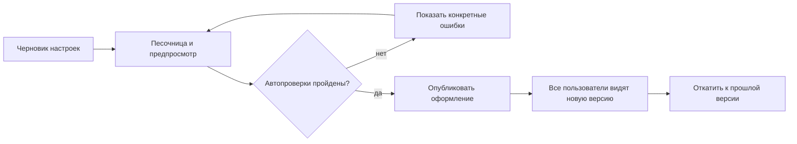

# Временные заметки по улучшению дашборда

> **Временный рабочий файл.** Здесь собираем идеи, решения и отметки о
> выполнении. Когда всё нужное будет реализовано и перенесено в постоянную
> документацию, файл удалить.
>
> Создан: 02.09.2026. Этот список не заменяет `ROADMAP.md` и пока не меняет
> установленный там порядок технических работ.

## Как отмечаем состояние

- `[ ]` — ещё не начинали;
- `[~]` — в работе;
- `[x]` — сделано и проверено;
- `[?]` — сначала нужно принять решение;
- `[⏸]` — сознательно отложено.

После реализации у пункта дописывать: дату, какие файлы изменены, как
проверено и какое решение принято. Не отмечать `[x]` без проверки.

## Зафиксированные решения и идеи

### Главный экран и аналитические подсказки

- `[ ]` Сделать блок, который сразу показывает, что требует внимания:
  наибольшие отклонения, сильный рост и спад, основной вклад регионов,
  программ или БВУ.
- `[?]` До проектирования определить точные правила расчёта каждого сигнала:
  с чем сравниваем, какой порог считаем существенным, сколько сигналов
  показываем и что происходит при неполных данных.
- `[?]` Решить, от каких **реальных** данных строится первая версия блока.
  Отклонение от плана нельзя делать боевым, пока не появился настоящий
  источник плана. До этого возможен честный вариант «изменение к прошлому
  периоду».
- `[ ]` Каждый сигнал должен вести в соответствующий раздел и разрез, а не
  быть отдельной тупиковой карточкой.

Предпочтительный принцип: блок не пересказывает весь дашборд, а показывает
3–5 исключений, которые действительно требуют внимания.

### Избранные разделы

- `[ ]` Пользователь сможет добавить раздел в избранное и быстро открыть его.
- `[?]` Предпочтительный вариант — избранное **личное для каждого
  пользователя**, а общий порядок разделов задаёт администратор. Иначе один
  человек будет перестраивать навигацию всем остальным.
- `[?]` До LDAP решить, где временно хранить личное избранное. После LDAP
  привязать его к устойчивому идентификатору пользователя.
- `[ ]` Предусмотреть пустое состояние: «В избранном пока ничего нет» и
  понятное действие «Добавить в избранное».

### Фильтры

- `[x]` 02.09.2026: видимые фильтры года и региона возвращены.
- `[x]` Область действия — весь сайт. Компоненты живут в общем каркасе,
  поэтому выбранные значения переживают переход между разделами.
- `[x]` Рядом показан текущий контекст; команда «Сбросить фильтры» доступна,
  только когда выбор отличается от исходного.
- `[x]` Если у показателя нет выбранного года, диаграмма показывает последний
  доступный год и явно подписывает это. Общее правило объяснено под фильтрами.
- `[x]` Проверено в браузере 02.09.2026: год и регион сохраняются при переходе
  в другой раздел, данные пересчитываются, сброс возвращает исходный контекст.
  Светлая и тёмная темы проверены; новый список Dash локализован на русский.

### Разные последние годы у показателей — пояснение пункта 3

Да, имеется в виду именно такой случай:

1. В общем наборе уже есть строки за 2026 год.
2. У показателя «Выдано кредитов» есть данные за 2026 год.
3. У показателя «Создано рабочих мест» последняя непустая строка только за
   2025 год.
4. Страница открыта в контексте 2026 года, но второй показатель через
   `data.resolve_year()` берёт 2025 год, чтобы не показать пустоту.

Это полезное техническое поведение, но возникает риск: человек может решить,
что **все** числа относятся к 2026 году. Поэтому:

- `[ ]` если показатель вынужденно показывает другой год, рядом с ним явно
  писать: «2025 — последние доступные данные»;
- `[ ]` не прятать такую подстановку только в подсказке по наведению;
- `[?]` при возврате фильтров решить, разрешаем ли подстановку вообще или при
  явно выбранном пользователем 2026 годе честнее показать «нет данных».

Предпочтительный вариант: автоматическая подстановка допустима в обзорном
режиме «последние доступные данные», но при явном выборе конкретного года
пользователем лучше не менять год молча.

### Масштаб полос в «Разбивке по программам» — схема пункта 4

Сейчас максимальная программа **внутри каждого инструмента** получает полную
ширину. У соседних колонок разные масштабы.

Условный пример:

```text
Текущий независимый масштаб

Гарантирование   500 млрд  ████████████████████  100% своей колонки
Кредитование     100 млрд  ████████████████████  100% своей колонки
Субсидирование    20 млрд  ████████████████████  100% своей колонки

Полосы одинаковые, хотя первое значение в 5 раз больше второго
и в 25 раз больше третьего.

Общий масштаб

Гарантирование   500 млрд  ████████████████████
Кредитование     100 млрд  ████
Субсидирование    20 млрд  █
```

Независимый масштаб лучше отвечает на вопрос «какая программа крупнейшая
внутри этого инструмента». Общий масштаб лучше отвечает на вопрос «насколько
инструменты велики относительно друг друга».

- `[x]` Решено 02.09.2026: блок отвечает на сравнение программ **внутри
  каждого инструмента**. Общие объёмы инструментов уже показаны выше.
- `[x]` Независимый масштаб оставлен, в обоих состояниях главной добавлено
  явное пояснение:
  «масштаб внутри инструмента». Числа остаются обязательными.
- Общий масштаб не выбран: он повторял бы сравнение инструментов и делал бы
  программы небольших инструментов почти невидимыми.

Предпочтение на текущем экране: оставить независимый масштаб для ранжирования
программ внутри инструмента, но убрать ложное ощущение общей шкалы — сильнее
разделить колонки и дать короткое пояснение масштаба. Общие размеры
инструментов уже показаны выше отдельными итогами.

### Подсказки к взаимодействиям

- `[x]` 02.09.2026: объяснено, что по столбцу года можно нажать и раскрыть
  месяцы.
- `[x]` 02.09.2026: объяснено, что выбор отрасли подсвечивает её сразу в нескольких
  разрезах.
- `[x]` 02.09.2026: после выбора показывается состояние «Выбрано: …» и действие
  «Сбросить».
- `[x]` 02.09.2026: строки получили роль кнопки, `aria-pressed`, видимый
  фокус и управление клавишами Enter/Пробел. Статус озвучивается через
  `aria-live`.

### Дата и свежесть данных

- `[x]` 02.09.2026: выбрано точное значение — дата и время публикации версии,
  которую сейчас видит пользователь.
- `[x]` Подпись изменена на «Данные опубликованы»; подсказка раскрывает смысл.
- `[x]` Пульсирующая точка стала статичной: это отметка версии, а не индикатор
  живого соединения.
- Время запуска ETL, время получения источника и максимальная дата записи этой
  подписью не называются.

### Контраст и читаемость

- `[x]` 02.09.2026: тон «Все инструменты» в тёмной теме изменён с `#2e7d55`
  на `#3b9567`; контраст вырос с 3,45:1 до **4,69:1**.
- `[x]` 02.09.2026: непрозрачность `--damu-muted` на светлой теме поднята
  с 0,55 до 0,65; контраст на поверхности вырос с 3,56:1 до **4,78:1**.
- `[ ]` Проверить все подписи меньше 12 px и по возможности поднять основной
  минимум. Существенные подписи не должны зависеть от очень мелкого кегля.
- `[x]` Подписи герой- и KPI-карточек подняты примерно с 9,6–9,9 до 11,2 px;
  пары цветов проверены расчётом и глазами в обеих темах.

## Настройки администратором: рекомендуемая модель

### Главный принцип

Администратору нужна не абсолютная свобода, а **свобода внутри безопасных
ограничений**. Конструктор должен позволять перестраивать смысловой экран, но
не давать случайно сделать нечитаемую сетку, нарушить цветовую семантику или
показать несовместимые данные.



Оформление и расположение виджетов применяются сразу после публикации и не
должны ждать шлюза данных 9:00: это уже существующий принцип проекта.

### Четыре разных уровня настроек

Не смешивать всё на одном экране:

1. **Общие настройки сайта** — логотип, название, утверждённая палитра,
   семейство шрифта, общий масштаб текста, вид шапки.
2. **Структура раздела** — порядок вкладок и секций, видимость, заголовки,
   герой-блок, порядок смысловых групп.
3. **Виджеты секции** — показатель, совместимый вид диаграммы, размер,
   порядок, дополнительные разрешённые параметры.
4. **Личные настройки пользователя** — избранные разделы и позднее, если
   понадобится, сохранённые наборы фильтров. Они не меняют сайт для всех.

### Что дать администратору в конструкторе разделов

- `[ ]` Выбрать раздел и вкладку для редактирования.
- `[ ]` Перетаскивать виджеты мышью и менять их порядок с клавиатуры.
- `[ ]` Добавлять и убирать виджет из списка разрешённых показателей.
- `[ ]` Выбирать совместимый вид диаграммы.
- `[ ]` Менять размер **пресетом**, а не произвольными пикселями.
- `[ ]` Скрывать секцию без удаления её настроек.
- `[ ]` Переставлять вкладки и секции внутри раздела.
- `[?]` Решить, может ли администратор переименовывать разделы и вкладки или
  названия остаются частью утверждённого реестра.

Рекомендуемые пресеты сетки можно строить поверх уже существующих 12 колонок:

- компактный — 4 колонки;
- средний — 6 колонок;
- широкий — 12 колонок;
- низкий широкий — 12 колонок с небольшой высотой;
- герой-блок — отдельный утверждённый шаблон.

Свободное растягивание до любого пикселя лучше не давать: оно создаст сотни
почти одинаковых размеров, которые невозможно проверить и поддерживать.

### Как должна выглядеть песочница

Предпочтительная компоновка:

```text
┌ Библиотека ─────┬──────── Живой предпросмотр раздела ────────┬ Свойства ───┐
│ Показатели      │                                            │ Вид графика │
│ Диаграммы       │   [виджет 1        ][виджет 2            ] │ Размер      │
│ Готовые блоки   │   [виджет 3 на всю ширину                ] │ Заголовок   │
│                 │                                            │ Видимость   │
└─────────────────┴────────────────────────────────────────────┴─────────────┘

                   [Отменить] [Сохранить черновик] [Опубликовать]
```

Ключевые свойства:

- предпросмотр на настоящих данных или на явно помеченном безопасном снимке;
- светлая и тёмная тема переключаются прямо в песочнице;
- режимы ширины экрана для проверки переноса;
- сетка сама притягивает виджеты к допустимым колонкам;
- перед публикацией показываются ошибки и предупреждения;
- опубликованная версия не меняется, пока администратор работает с черновиком;
- есть история версий, автор, время, комментарий и откат;
- второй администратор не должен молча перезаписать чужой более свежий
  черновик.

### Шрифты

Что разрешить:

- выбор из заранее подключённых локальных семейств с кириллицей и знаком `₸`;
- общий масштаб: компактный / обычный / крупный;
- отдельную плотность диаграммы: обычная / плотная, если это действительно
  понадобится.

Что не разрешать:

- произвольное имя системного или интернет-шрифта;
- отдельный шрифт для каждой секции или диаграммы;
- произвольный размер каждого текста;
- размер, при котором подписи становятся меньше принятого минимума.

Причина: шрифт — часть общей геометрии сайта. Его смена меняет высоту шапки,
перенос вкладок, подписи диаграмм и число строк. Поэтому новый шрифт сначала
добавляется разработчиком в утверждённый список и проверяется, а администратор
выбирает только из этого списка.

### Цветовая палитра

Цвета лучше настраивать не по отдельным элементам, а как систему ролей:

- основной цвет интерфейса;
- цвет гарантирования;
- цвет кредитования;
- цвет субсидирования;
- нейтральные фон, поверхность, основной и приглушённый текст;
- отдельные семантические цвета предупреждения, ошибки и успеха.

Рекомендация:

- `[ ]` дать несколько проверенных готовых палитр;
- `[ ]` оставить расширенный режим со своими тремя акцентами;
- `[ ]` автоматически рассчитывать производные оттенки и цвет текста;
- `[ ]` перед публикацией проверять контраст в светлой и тёмной темах;
- `[ ]` запрещать публикацию при критической ошибке контраста;
- `[ ]` показывать предупреждение, если два инструмента стали визуально
  неразличимы или цвет инструмента совпал с цветом тревоги.

Не давать отдельную ручную окраску каждого виджета: цвет уже несёт устойчивый
смысл инструмента. Если разрешить локальные исключения, этот язык быстро
перестанет работать.

### Автопроверки перед публикацией

Конструктор должен проверять как минимум:

- все обязательные секции на месте;
- показатель и диаграмма совместимы;
- нет неизвестного ключа или удалённого показателя;
- заголовки и подписи не обрезаются в контрольных ширинах;
- сетка не имеет наложений и выхода за 12 колонок;
- минимальная высота достаточна для числа категорий;
- контраст проходит установленный порог;
- интерфейс остаётся работоспособным в светлой и тёмной темах;
- макетные данные по-прежнему явно помечены;
- пустой набор виджетов сохраняется как осознанный выбор, а не как ошибка.

### Что администратору лучше не давать

- произвольный CSS или HTML;
- произвольную ширину и высоту в пикселях;
- изменение формул показателей из визуального конструктора;
- изменение исходных данных;
- отключение маркировки макетных или тестовых данных;
- публикацию несовместимого вида диаграммы;
- возможность раскрасить каждый виджет независимо;
- необратимое удаление опубликованной конфигурации.

## Предлагаемый порядок развития конструктора

### Этап A — улучшить существующий настройщик

- `[ ]` Добавить визуальный предпросмотр выбранной страницы.
- `[ ]` Заменить только кнопки `↑`/`↓` на перетаскивание, сохранив доступный
  клавиатурный способ изменения порядка.
- `[ ]` Оставить существующие пресеты размера и показывать их прямо на сетке.
- `[ ]` Добавить предупреждения о несовместимых сочетаниях и кнопку отмены
  последних несохранённых изменений.

### Этап B — безопасная публикация

- `[ ]` Ввести черновик и опубликованную версию раскладки.
- `[ ]` Добавить предпросмотр светлой и тёмной темы.
- `[ ]` Добавить историю, автора, комментарий и откат.
- `[ ]` Защититься от одновременного редактирования двумя администраторами.

### Этап C — структура разделов

- `[ ]` Разрешить менять порядок вкладок и секций.
- `[ ]` Разрешить скрывать секции без удаления конфигурации.
- `[ ]` Добавить готовые шаблоны: обзор, рейтинг, динамика, сравнение.

### Этап D — личное избранное

- `[ ]` Добавить личные избранные разделы после появления устойчивой
  идентификации пользователей.
- `[?]` Решить, где они показываются: в шапке, в меню разделов или отдельным
  компактным блоком на главной. Предпочтение — верх списка «Разделы», чтобы
  не создавать ещё одну навигацию.

## Решения, которые нужно принять перед реализацией

1. Кто основной пользователь конструктора: один владелец дашборда или оба
   администратора на равных?
2. Избранное точно личное или нужны ещё общие «рекомендуемые разделы»?
3. Полосы программ отвечают на сравнение программ внутри инструмента или на
   сравнение самих инструментов?
4. Можно ли администратору менять названия вкладок и секций?
5. Кто имеет право публиковать черновик и откатывать опубликованную версию?
6. Какие секции считаются обязательными и не могут быть скрыты?

## Короткая очередь на будущее

1. `[x]` Контраст и читаемость — известные две пары исправлены, измерены и
   проверены глазами в светлой и тёмной темах. Полный аудит остальных мелких
   подписей по всему сайту остаётся отдельной задачей.
2. `[x]` Подсказки к кликам, видимое выбранное состояние, сброс и клавиатура.
3. `[x]` Полосы сравнивают программы внутри своего инструмента; смысл шкалы
   теперь написан на экране.
4. `[?]` Проектирование блока отклонений на доступных реальных данных.
5. `[x]` Фильтры возвращены глобально: год и регионы сохраняются между
   разделами, текущий выбор и сброс видимы. 02.09.2026 полоса уплотнена
   до одной строки: убраны видимые заголовок, подписи полей и нижнее
   примечание; подписи сохранены скрытыми для экранных дикторов.
   `??` После уплотнения нужна визуальная проверка с разрешения пользователя.
6. `[x]` В шапке показана дата публикации видимой версии данных.
7. `[?]` Проектирование черновика, публикации и отката конструктора.
8. `[⏸]` Личное избранное — после устойчивой идентификации пользователя.
9. `[?]` Адаптивность главной и раздела: в узком окне виден горизонтальный
   скролл и часть шапки уходит за правую границу. Разбирать отдельно, потому
   что это существующее поведение и оно шире первых трёх задач.
10. `[x]` Справочник регионов нормализован 02.09.2026 в `core/data.py`:
    48 исходных написаний сведены к 20 каноническим, варианты `РФ по …`
    привязаны к своим областям, пробелы в названиях городов унифицированы.
    По решению пользователя три новых области показаны в казахском написании:
    `Абай`, `Жетісу`, `Ұлытау`. `Неизвестно` и `Департамент гарантирования`
    сохранены в фактах, чтобы не менять итоги, но исключены из географического
    фильтра. Оригиналы в `data/raw/` не изменялись.
